```mermaid
graph TD
    Start([User visits diagram_builder]) --> EmptyState[See Empty State Screen]
    EmptyState --> EmptyStateUI["UI Shows:<br/>- Large 'Import Codebase' button<br/>- Example workspace screenshot<br/>- Text: 'Start exploring your codebase in 3D'"]
    
    EmptyStateUI --> ClickImport{User clicks<br/>'Import Codebase'}
    
    ClickImport --> ImportModal[Import Modal Opens]
    ImportModal --> ImportUI["UI Shows:<br/>- GitHub URL input<br/>- Local path input<br/>- Workspace name field<br/>- 'Import' button primary"]
    
    ImportUI --> EnterDetails[User enters repository details]
    EnterDetails --> ClickImportBtn{Clicks 'Import'}
    
    ClickImportBtn --> Validate{Valid<br/>repository?}
    Validate -->|No| ShowError[Show inline error:<br/>'Repository not found']
    ShowError --> ImportUI
    
    Validate -->|Yes| StartParsing[Backend starts parsing]
    StartParsing --> ShowProgress[Modal shows progress:<br/>'Parsing repository...'<br/>Progress bar 0-100%]
    
    ShowProgress --> PollStatus{Check<br/>status}
    PollStatus -->|Processing| Wait[Wait 2 seconds]
    Wait --> PollStatus
    
    PollStatus -->|Failed| ShowFailure[Show error notification:<br/>'Import failed. Try again?'<br/>Retry button]
    ShowFailure --> ImportUI
    
    PollStatus -->|Completed| CloseModal[Modal closes]
    CloseModal --> CameraFlight[Camera flies to repository root]
    CameraFlight --> Show3D[3D graph renders]
    
    Show3D --> ShowUI["UI appears:<br/>- HUD top-left: node count<br/>- Search bar top-center: visible<br/>- MiniMap bottom-right: overview<br/>- Success toast: 'Loaded 1,248 nodes'"]
    
    ShowUI --> UserExplores[User starts exploring]
    UserExplores --> Success([✅ First exploration complete])
    
    ShowFailure -.->|User retries| ClickImportBtn
    ShowUI -.->|After 3s| Tooltip[Tooltip appears:<br/>'Press ⌘K to search']
```

# UX Design Specification - diagram_builder

**Author:** Brian
**Date:** 2026-01-22

---

## Executive Summary

### Project Vision

**diagram_builder** is a 3D codebase visualization platform that transforms architectural understanding from a text-based, file-by-file grind into a spatial exploration experience. The core insight: code structure already encodes architectural decisions (dependencies, boundaries, coupling), but these relationships are invisible in text. By rendering code spatially, developers can answer "how does this system work?" in minutes instead of days.

The platform serves a specific need that emerges at scale: understanding architectural relationships across large, complex, or unfamiliar codebases. It's not a daily code editor replacement—it's the tool you reach for when you need to understand, communicate, or document system architecture.

**Current Implementation Status:**
- MVP Phase 4-6 in progress (parser, visualization, navigation working)
- Recent features: hybrid Orbit/Fly navigation, MiniMap with jump-to, node labels
- Critical UX gaps identified: search functionality, flat 3D layout, minimap rendering

### Target Users

**Primary Users:**
- **Software Architects** - Need to understand system design, identify bottlenecks, conduct architecture reviews
- **Technical Leads** - Responsible for communicating architecture across teams, onboarding new developers
- **Engineering Managers** - Need to visualize impact of changes, assess technical debt, explain system complexity to stakeholders

**Secondary Users:**
- **Developers Onboarding** - New to a complex/large codebase, need to understand structure progressively
- **Code Reviewers** - Understanding multi-file changes, assessing architectural impact of PRs
- **Technical Writers** - Generating always-current architectural documentation

**User Context:**
- Tech-savvy (developers/architects)
- Working with codebases ranging from 1,000 to 100,000+ files
- Primary use cases: microservices architecture analysis, monolith understanding, dependency auditing
- Devices: Desktop/laptop (WebGL required), browser-based
- Environment: Both individual exploration and collaborative team sessions

**Not For:**
- Daily code navigation (use IDE for that)
- Line-by-line debugging (use debugger)
- Simple single-service applications where mental models suffice

### Key Design Challenges

**1. Search & Jump-to Functionality (Priority 1 - Most Critical)**

**Challenge:** Users need to find specific code elements (files, classes, methods) in a 3D space containing thousands of nodes and navigate to them instantly.

**Current State:** Search functionality not working, jump-to not functioning

**User Need:** "I want to type 'AuthService' and immediately fly to it in the 3D space, seeing everything connected to it highlighted as I arrive."

**Design Considerations:**
- Search scope (exact vs. fuzzy matching - "auth" should find "AuthService", "authenticate", "authMiddleware")
- Result ranking when multiple matches found (Files > Classes > Methods? By usage frequency?)
- Visual arrival experience:
  - Center camera on target node
  - Highlight immediate connections to show context
  - Option to animate "trace path" from root to target
- Search-as-you-type with instant 3D highlighting
- Search filters (by type: class/file/method, by complexity, by relationship)

**2. Flat 3D Layout Problem (Priority 2 - Architecture Visibility)**

**Challenge:** Current force-directed layout renders all nodes on a flat plane, making it impossible to perceive architectural layers, hierarchies, or patterns. Users can't distinguish between "this is a UI component" vs "this is a database utility."

**Current State:** Nodes lack vertical depth/layering

**User Need:** "I want to see index.ts or main.ts as the clear 'center of gravity', with everything else positioned by how it connects to the root. Unexpected connections should be visually jarring."

**Root-Centric Layout Strategy:**

**Radial/Hierarchical Hybrid:**
- **Root/Entry Points** (center, elevated): index.ts, main.ts, app.ts - the "you are here" starting point
- **Direct Dependencies** (first ring): Services, controllers, routers that root imports directly
- **Secondary Dependencies** (second ring): Utilities, helpers, models that services use
- **Leaf Nodes** (outer ring): Pure functions, constants, types with no outgoing dependencies

**Vertical Layering by Architectural Tier:**
- **Top tier** (Y-axis high): Entry points, public APIs, application root
- **Middle tier** (Y-axis medium): Business logic, services, controllers
- **Bottom tier** (Y-axis low): Data access, utilities, types, constants

**Unexpected Connections Highlighted:**
- Cross-layer violations (UI → Database direct) shown as **bright red/yellow lines**
- Circular dependencies shown as **pulsing/animated connections**
- "Hot zones" where many modules converge shown as **node clusters with visual halos**

**Multi-Layout Options:**
Users should be able to switch layouts based on task:
- **Architecture Review Layout**: Layers by architectural tier
- **Dependency Analysis Layout**: Depth-based positioning from root
- **Code Review Layout**: Changed files highlighted and centered
- **Custom Layout**: User-defined positioning rules

**3. Empty 3D MiniMap (Priority 3 - Navigation Anchor)**

**Challenge:** Users get lost in 3D space with no orientation reference. The spatial overview minimap is not rendering, leaving users without a navigation anchor.

**Current State:** SpatialOverview component not displaying nodes

**User Need:** "I'm lost in this 3D space - the minimap should show me where I am, what I'm looking at, and let me click anywhere to jump there instantly."

**MiniMap Design Requirements:**
- Simplified representation: small colored spheres for each node (color by type: blue=file, purple=class, green=function)
- Camera FOV cone/frustum showing "you are currently looking at this region"
- Click any sphere → camera flies smoothly to that location
- Shows "big picture" overview even when main canvas is zoomed into details
- "You are here" indicator showing current camera position
- Always visible, always functional (never empty)

**Open Design Question:** Should minimap auto-rotate slowly to help users build spatial mental model, or stay static for orientation stability?

**4. Spatial Disorientation**

**Challenge:** 3D navigation introduces cognitive load - users can lose track of where they are in the codebase, which direction they're facing, and how to get back to familiar locations.

**Mitigation Strategies Already Implemented:**
- HUD with breadcrumbs showing current file → class → method hierarchy
- Control mode indicator (Orbit 🔄 vs Fly ✈️)
- Node count display
- Dual navigation modes (Orbit for study, Fly for exploration)

**Additional Needs:**
- Navigation history ("back" button to return to previous location)
- Bookmarks/favorites for frequently visited nodes
- Coordinate system display (`service:class:method:line` format)
- Visual "home" button to return to root/entry point

**5. LOD System Transparency**

**Challenge:** Automatic Level-of-Detail system hides/shows nodes based on zoom level. If done poorly, users feel disoriented when detail suddenly appears/disappears.

**Current State:** LOD system implemented (default level 4), but user feedback on discoverability unknown

**User Need:** Users should understand WHY certain nodes are visible/hidden and have control over detail level when needed.

**Design Considerations:**
- LOD level indicator in HUD showing current detail level
- Manual LOD override controls
- Smooth transitions when detail changes (fade in/out, not pop)
- Pre-configured LOD profiles (Architecture Review, Security Audit, Code Review, Performance Analysis)
- Visual cues when additional detail is available (e.g., "zoom in to see methods")

### Design Opportunities

**1. Root-Centric Architectural Discovery**

**Opportunity:** Make architectural patterns immediately visible through spatial positioning and visual encoding.

**Design Approach:**
- **Root as "Home Base"**: Entry points (index.ts, main.ts) are always visible, elevated, and visually distinct
- **Connection-First Visualization**: Relationships between modules are MORE visually prominent than individual files
- **Surprise Discovery**: Unexpected dependencies (cross-layer violations, circular dependencies) are visually jarring—impossible to miss
- **Progressive Disclosure**: Start with high-level structure (services, modules), zoom in to reveal classes/methods

**User Value:**
- Answer "how does this system work?" in 20 minutes instead of 2 days
- Spot architectural anti-patterns immediately (tight coupling, layer violations)
- Onboard new developers by giving them a visual "map" of the codebase

**2. Search as Spatial Navigation Gateway**

**Opportunity:** Search isn't just "find text"—it's the primary way users navigate 3D space. Make search feel like teleportation with context.

**Design Approach:**
- **Instant Visual Feedback**: As you type, matching nodes pulse/glow in 3D space
- **Search Results as Waypoints**: Each result is a "destination" with a preview of its connections
- **Contextual Arrival**: When you jump to a search result, camera shows that node PLUS its immediate architectural context
- **Path Tracing**: Option to "show me how to get there from root" with animated connection path

**User Value:**
- No more "Ctrl+F through 50 files" to find something
- Search becomes architectural exploration, not just text matching
- New users can explore by searching for familiar concepts ("auth", "user", "payment")

**3. Minimap as Persistent Orientation Anchor**

**Opportunity:** The minimap isn't just navigation—it's how users build a mental model of the entire codebase structure.

**Design Approach:**
- **Always-On Awareness**: Minimap never disappears, never goes blank
- **Dual View Strategy**: Tree view (familiar file hierarchy) + Spatial view (3D overview) work together
- **"You Are Here" Confidence**: Camera FOV cone in minimap shows exactly what you're looking at in main canvas
- **One-Click Anywhere**: Click minimap → camera smoothly flies to that location (never jarring instant jumps)

**User Value:**
- Never feel lost in 3D space
- Build intuition about codebase structure even while zoomed into details
- Quick navigation without typing/searching

**4. Multi-Layout System for Different Tasks**

**Opportunity:** Different users have different goals (architecture review vs onboarding vs debugging). Let layout adapt to task.

**Design Approach:**
- **Task-Based Layouts**: Pre-configured layouts optimized for specific use cases
  - "Architecture Review": Layers by tier, emphasizes boundaries
  - "Dependency Analysis": Radial from root, emphasizes connection depth
  - "Code Review": Changed files centered and highlighted
  - "Onboarding": Simplified view showing only major modules
- **Layout Switching**: Quick toggle in HUD to change layout without losing position
- **Custom Layouts**: Advanced users can save their own layout configurations

**User Value:**
- Same codebase, different perspectives based on what you're trying to understand
- Faster time-to-insight because layout matches mental model for the task
- Team standardization (everyone uses "Architecture Review" layout for reviews)

**5. Collaborative Spatial Exploration**

**Opportunity:** Architecture discussions happen in teams. Make exploration collaborative, not solitary.

**Design Approach:**
- **Spatial Avatars**: See where teammates are looking in real-time (small floating indicators)
- **Viewpoint Sharing**: "Come look at this" sends exact camera position + filters via URL
- **Coordinate-Based Communication**: Share precise locations like GPS coordinates (`auth-service:TokenValidator.verify:L145`)
- **Annotation System**: Leave notes/comments attached to specific nodes for future explorers

**User Value:**
- Architecture reviews become interactive exploration sessions, not static presentations
- Knowledge capture—tribal knowledge gets documented spatially
- Onboarding: senior devs can "guide tours" through the codebase

### Key UX Principles for diagram_builder

These principles should guide all design decisions:

1. **Root-Centric Navigation** - Users should always know where "home" is (entry points visible and reachable)
2. **Connection Visibility** - Relationships between code elements are more important than individual files
3. **Surprise Discovery** - Unexpected architectural patterns should be visually obvious, even jarring
4. **Never Lost** - Search, minimap, breadcrumbs, and coordinate system work together to prevent spatial disorientation
5. **Task-Appropriate Views** - Different layouts for different goals (review, onboarding, debugging)
6. **Progressive Disclosure** - Start with overview, reveal detail as users zoom in (via LOD system)
7. **Spatial Intuition** - Proximity = coupling, vertical position = architectural layer, visual weight = complexity

## Core User Experience

### Defining Experience

**The Core Loop: Find → Navigate → Understand**

The defining user experience of **diagram_builder** is a continuous cycle of architectural discovery:

1. **Find** - Search for any code element (file, class, method) using fuzzy search
2. **Navigate** - Camera flies smoothly to that element in 3D space
3. **Understand** - See immediate architectural context (what it connects to, where it sits in the hierarchy, what depends on it)

This loop is the heartbeat of the product. Users don't "browse" a codebase—they explore it spatially, jumping between points of interest, following connections, and building mental models through repeated discovery cycles.

**Secondary Interactions Supporting the Core:**
- **Connection exploration**: Click/hover nodes to reveal relationships and trace dependency paths
- **Layout switching**: Change perspective based on task (Architecture Review, Dependency Analysis, Code Review)
- **Zoom traversal**: Zoom out for "big picture" architecture, zoom in for class/method details
- **Viewpoint capture**: Save and share architectural discoveries with teammates

**What Makes It Different:**
Unlike traditional code navigation (file trees, grep, go-to-definition), diagram_builder makes **relationships primary**. You don't navigate files—you navigate connections. The question isn't "where is this file?" but "what does this connect to?"

### Platform Strategy

**Primary Platform: Desktop Web Application**

**Platform Choice Rationale:**
- **Browser-based**: Zero installation, works everywhere, easy sharing via URLs
- **Desktop/laptop required**: 3D WebGL rendering + complex navigation requires screen real estate and GPU capability
- **Mouse + keyboard optimized**:
  - Mouse: Orbit mode (drag to rotate), click nodes, minimap interaction
  - Keyboard: Fly mode (WASD movement), search (fuzzy find), shortcuts (C to toggle control mode)
- **No mobile in MVP**: Touch-based 3D navigation would require fundamentally different UX (pinch-zoom, two-finger rotate) - defer to post-MVP

**Technical Requirements:**
- **WebGL support**: Modern browser with GPU acceleration (Chrome, Firefox, Safari, Edge latest 2 versions)
- **Minimum resolution**: 1280x800 (ideally 1920x1080+ for comfortable spatial navigation)
- **Recommended specs**: 8GB RAM, dedicated GPU for large codebases (10,000+ files)

**Platform Capabilities Leveraged:**
- **WebGL/Three.js**: Hardware-accelerated 3D rendering (60fps minimum)
- **WebSockets**: Real-time multi-user collaboration and position synchronization
- **URL state management**: Viewpoints encoded in URLs for instant sharing
- **Browser APIs**: Clipboard for coordinate copying, local storage for workspace preferences

**Offline Considerations:**
- **Not supported in MVP**: Parsing requires Neo4j backend, collaboration requires WebSocket connection
- **Post-MVP potential**: Cached workspace snapshots for offline exploration (read-only)

### Effortless Interactions

**1. Finding Anything - Zero-Friction Search**

**User Expectation:** "I should be able to type 'auth' and instantly see all authentication-related code, no matter how buried it is."

**Effortless Design:**
- **Search-as-you-type**: No "submit" button—results appear as you type
- **Fuzzy matching**: "auth" finds "AuthService", "authenticate", "authMiddleware", "OAuth"
- **3D highlighting**: Matching nodes pulse/glow in 3D space while dropdown shows list
- **Smart ranking**: Files > Classes > Methods, weighted by usage/importance
- **Keyboard navigation**: Arrow keys through results, Enter to fly to selection
- **No escape needed**: Click anywhere in 3D to dismiss search and keep exploring

**What Makes It Effortless:**
Users never wonder "how do I find this?" The search bar is always visible, always responsive, and finding anything is muscle memory: `Cmd+K` → type → Enter.

**2. Never Getting Lost - Persistent Orientation**

**User Expectation:** "No matter where I am in 3D space, I should always know where I am and how to get back."

**Effortless Design:**
- **HUD breadcrumbs**: Always visible path showing `Repository > Service > Class > Method`
- **MiniMap "you are here"**: Camera FOV cone in spatial overview shows exactly what you're looking at
- **Home button**: One-click return to root/entry points (index.ts, main.ts)
- **Navigation history**: Back/forward buttons like a browser (Cmd+[, Cmd+])
- **Coordinate display**: Current location shown as `auth-service:TokenValidator:L145`

**What Makes It Effortless:**
Orientation is automatic—users never think "wait, where am I?" The combination of breadcrumbs, minimap, and home button creates constant spatial awareness.

**3. Seeing Connections - Hover to Reveal**

**User Expectation:** "When I look at a node, I should instantly see what it connects to without clicking or searching."

**Effortless Design:**
- **Hover highlight**: Mouse over node → immediate connections fade in (incoming green, outgoing blue)
- **Connection preview**: Tooltip shows relationship type ("imports 3 modules", "called by 7 functions")
- **Dimming non-connected**: Everything not related to hovered node fades to 30% opacity
- **No click required**: Information appears on hover, click only needed to navigate
- **Persistent on click**: Click to "lock" the connection view for deeper exploration

**What Makes It Effortless:**
Understanding relationships requires zero interaction beyond looking. Hover = reveal—no menus, no right-clicks, no mode switches.

**4. Layout Switching - One-Button Perspective Change**

**User Expectation:** "I should be able to see the same codebase from different architectural perspectives instantly."

**Effortless Design:**
- **Layout selector in HUD**: Dropdown showing current layout (e.g., "Architecture Review")
- **Pre-configured options**: Architecture Review, Dependency Analysis, Code Review, Onboarding
- **Instant transition**: Smooth 2-second animation to new layout (not jarring instant jump)
- **Context preservation**: Camera stays focused on same node, just repositioned in new layout
- **Keyboard shortcut**: `L` opens layout picker, `1-4` switches to preset layouts

**What Makes It Effortless:**
Changing perspective is as simple as changing IDE themes—one button, immediate feedback, no complex configuration.

**5. Sharing Discoveries - URL = Viewpoint**

**User Expectation:** "When I find something interesting, I should be able to share exactly what I'm seeing with my team instantly."

**Effortless Design:**
- **Share button in HUD**: One click copies viewpoint URL to clipboard
- **URL encodes everything**: Camera position, selected node, filters, layout, annotations
- **Instant context restoration**: Teammate clicks URL → sees identical view (no setup)
- **Coordinate shorthand**: Can share just coordinates `auth-service:TokenValidator:L145` for quick references
- **Slack/GitHub integration**: Viewpoint links auto-preview with screenshot

**What Makes It Effortless:**
Sharing architectural insights is as easy as sharing a Google Docs link—copy, paste, done. No export, no screenshots, no "let me show you on my screen."

### Critical Success Moments

**Moment 1: First Load Revelation (Within 30 Seconds)**

**What Happens:**
User loads their codebase for the first time → parser runs → 3D visualization appears showing their architecture spatially

**Success Criteria:**
- **Under 30 seconds** from "import codebase" to seeing 3D visualization
- **Immediate recognition**: User thinks "that's my API layer, that's my database layer"
- **Visual hierarchy clear**: Root/entry points visually distinct and centered
- **Not overwhelming**: Default LOD shows high-level structure (services, major modules) not every file

**Why It's Critical:**
This is the "is this worth my time?" moment. If the first load is slow, confusing, or shows a meaningless blob of nodes, users abandon. If they see their architecture revealed spatially within 30 seconds, they're hooked.

**Failure Mode:**
- Parsing takes 5+ minutes → user gets impatient, closes tab
- Flat layout with no hierarchy → "this is just a mess, I can't understand anything"
- All 10,000 files visible at once → cognitive overload, user gives up

**Moment 2: Search → Fly → Understand (Under 3 Seconds)**

**What Happens:**
User types "AuthService" in search → hits Enter → camera flies smoothly to that node → immediately sees what it imports and what imports it

**Success Criteria:**
- **Search latency < 500ms**: Results appear instantly as you type
- **Fly animation 1-2 seconds**: Smooth camera movement, not jarring teleport
- **Connection reveal immediate**: Upon arrival, connected nodes highlighted automatically
- **Contextual zoom**: Camera positions at right distance to see node + immediate connections

**Why It's Critical:**
This is the core loop—if search → navigate → understand feels slow, clunky, or requires multiple steps, users will fall back to IDE search. It must be **faster and more intuitive** than Cmd+Shift+F.

**Failure Mode:**
- Search takes 2+ seconds → feels laggy, users lose flow
- Jump instant without animation → disorienting, "where am I now?"
- Connections not visible → users have to manually explore, defeats purpose

**Moment 3: The "Aha!" - Discovering Unexpected Connections**

**What Happens:**
User zooms out to overview → notices two modules connected that shouldn't be → "Wait, the UI layer is directly importing database code? That's a violation!"

**Success Criteria:**
- **Unexpected connections visually obvious**: Cross-layer violations shown as bright red/yellow lines
- **User reacts emotionally**: "I had no idea!", "That explains the bug!", "We need to fix this!"
- **Shareable discovery**: User clicks "Share" → sends viewpoint to team → discussion begins
- **Actionable insight**: Discovery leads to architectural decision or refactoring

**Why It's Critical:**
This is the unique value prop—discovering architectural patterns you couldn't see in text. If spatial visualization doesn't reveal insights faster than reading code, the tool has no reason to exist.

**Failure Mode:**
- All connections look the same → no visual hierarchy of "expected vs unexpected"
- User finds violation manually after hours of exploration → too slow, not valuable
- Discovery isn't shareable → insight lost, team doesn't see it

**Moment 4: The "Can't Go Back" - Tool Becomes Indispensable**

**What Happens:**
Week later, user is debugging in IDE → trying to trace dependencies manually → remembers diagram_builder exists → "Why am I doing this the hard way?" → switches to diagram_builder → solves problem in minutes

**Success Criteria:**
- **Repeated usage**: User returns to tool multiple times per week
- **Muscle memory formed**: User's first instinct for architecture questions is diagram_builder, not IDE
- **Team adoption**: User shows tool to colleagues → organic spreading
- **Workflow integration**: Tool becomes part of architecture reviews, onboarding, documentation

**Why It's Critical:**
One-time "wow" isn't enough—tool must become **habitual**. This moment determines retention and long-term adoption.

**Failure Mode:**
- User tries tool once → "cool but not useful" → never returns
- Easier to use IDE than learn 3D navigation → friction too high
- Tool doesn't integrate into existing workflow → feels like extra work

### Experience Principles

**Guiding principles for all UX decisions in diagram_builder:**

**1. Search-First Navigation**

**Principle:** The fastest path to any code element is search, not browsing.

**Application:**
- Search bar always visible and accessible (Cmd+K global shortcut)
- File trees and folder hierarchies are secondary navigation, not primary
- Every node is reachable via search in under 3 seconds (search + fly)

**Anti-Pattern:** Requiring users to "drill down" through folder structures to find files

**2. Relationships Over Files**

**Principle:** Understanding connections is more important than viewing individual files.

**Application:**
- Connections (edges) are visually prominent with colors, thickness, animation
- Hover reveals relationships immediately (no clicking required)
- Unexpected connections are visually jarring (bright colors, pulsing)
- Node isolation shows what depends on it and what it depends on

**Anti-Pattern:** Making relationships secondary to file properties (size, line count, etc.)

**3. Never Lost, Always Oriented**

**Principle:** Users should never wonder "where am I?" or "how do I get back?"

**Application:**
- Persistent HUD with breadcrumbs, minimap, coordinate display
- Home button always visible to return to root
- Back/forward navigation like a browser
- MiniMap shows camera FOV cone ("you are looking here")

**Anti-Pattern:** Assuming users will remember their spatial location without UI affordances

**4. Progressive Disclosure Through LOD**

**Principle:** Show high-level structure by default, reveal detail on demand through zoom.

**Application:**
- Default view: Services, major modules, entry points (NOT every file)
- Zoom in → classes appear
- Zoom in more → methods appear
- LOD transitions smooth (fade in/out) not jarring (pop in/out)
- Manual override available for users who want full detail

**Anti-Pattern:** Showing all 10,000 files at once → cognitive overload

**5. Task-Appropriate Perspectives**

**Principle:** Different goals require different layouts—let users switch perspective based on what they're trying to understand.

**Application:**
- Pre-configured layouts for common tasks (Architecture Review, Dependency Analysis, Code Review)
- One-button layout switching with smooth transitions
- Layout preserves camera focus (same node, different positioning)
- Team can standardize on layouts for consistency

**Anti-Pattern:** Single fixed layout that tries to serve all use cases poorly

**6. Collaboration is Core, Not Add-On**

**Principle:** Architecture understanding is a team activity—make sharing and collaboration effortless.

**Application:**
- Viewpoint URLs encode complete state (camera, filters, layout, annotations)
- One-click sharing via clipboard
- Multi-user sessions with spatial avatars
- Coordinate-based communication (e.g., "meet me at auth-service:L145")

**Anti-Pattern:** Treating exploration as solitary, making sharing an afterthought

**7. Speed is a Feature**

**Principle:** Every interaction should feel instant—waiting breaks flow state.

**Application:**
- Search results < 500ms
- Camera fly animations 1-2 seconds (fast but smooth)
- Layout switching < 2 seconds
- 60fps rendering minimum (no stutter or lag)
- First load < 30 seconds

**Anti-Pattern:** Accepting slow interactions because "it's a complex operation"

## Desired Emotional Response

### Primary Emotional Goals

**The Core Feeling: "Ah-ha! Now I See It!"**

The defining emotional experience of **diagram_builder** is the moment of **architectural clarity**—when relationships that were invisible in text suddenly become obvious in 3D space. This is the emotional payoff that justifies learning a new tool and changing workflow.

**Primary Emotional States We Want to Create:**

1. **Clarity** - "I understand how this system works now"
   - Complex architectures become visually comprehensible
   - Dependencies and relationships are obvious, not hidden
   - Users can explain the system to others with confidence

2. **Empowerment** - "I'm in control of this exploration"
   - Users direct their own discovery journey
   - Navigation feels effortless and responsive
   - Users can switch perspectives and layouts at will
   - Architectural insights lead to actionable decisions

3. **Confidence** - "I know where I am and what I'm looking at"
   - Never lost or disoriented in 3D space
   - Always aware of position, context, and how to return home
   - Trust that the visualization accurately represents the codebase

4. **Curiosity** - "What else is connected? Let me explore..."
   - Exploration feels rewarding, not exhausting
   - Each discovery leads to new questions worth investigating
   - Users want to dig deeper, follow connections, understand relationships

**What Makes Users Tell Colleagues:**

"You HAVE to try this tool—I found a coupling issue between services in 5 minutes that would have taken me hours to discover reading code. Seeing the architecture in 3D just *makes sense*."

The emotional trigger for word-of-mouth: **Speed to insight + Visual obviousness of patterns**.

### Emotional Journey Mapping

**Stage 1: First Load (0-30 seconds) - Wonder → Recognition**

**Desired Emotions:**
- **Wonder**: "Whoa, this is my codebase in 3D!"
- **Recognition**: "That's my API layer, that's my database layer—I can see the structure!"
- **Intrigue**: "I want to explore this..."

**Design Support:**
- Parser completes in under 30 seconds (no long wait killing excitement)
- Default view shows clear hierarchy with root/entry points elevated and visually distinct
- LOD system hides overwhelming detail—show architecture, not every file
- Smooth auto-fit camera animation that reveals the full structure

**Emotional Failure Mode:**
- Long parsing (5+ minutes) → Impatience → "Is this worth it?" → User abandons
- Flat meaningless blob of nodes → Confusion → "I can't understand this" → User gives up
- All 10,000 files visible → Overwhelm → "Too much information" → Cognitive overload

**Stage 2: Search & Exploration (Core Loop) - Flow State**

**Desired Emotions:**
- **Flow**: Effortless navigation, no friction between thought and action
- **Control**: "I can go anywhere, find anything, see any perspective"
- **Orientation**: "I always know where I am, even when exploring deeply"

**Design Support:**
- Search responds instantly (< 500ms) with fuzzy matching
- Camera flies smoothly to targets (1-2 second animation, not jarring jump)
- HUD shows persistent breadcrumbs, minimap "you are here", coordinate display
- Hover reveals connections without clicking (zero-friction discovery)
- Home button always available to return to root

**Emotional Failure Mode:**
- Search lag (2+ seconds) → Frustration → "This feels slow" → User loses flow
- Instant jumps without animation → Disorientation → "Where am I now?" → Lost feeling
- No orientation cues → Anxiety → "How do I get back?" → User abandons exploration

**Stage 3: Discovery Moment - Surprise → Insight → Action**

**Desired Emotions:**
- **Surprise**: "Wait, THAT connects to THAT? I had no idea!"
- **Insight**: "That explains why we have that bug—these modules are coupled"
- **Empowerment**: "I need to share this with the team—we need to refactor"

**Design Support:**
- Unexpected connections visually obvious (bright red/yellow lines for cross-layer violations)
- Circular dependencies pulse/animate (impossible to miss)
- One-click sharing via viewpoint URLs (instant team communication)
- Connection context shows relationship type and dependency count

**Emotional Failure Mode:**
- All connections look identical → No surprise → "I could have found this in grep" → Tool not valuable
- Discovery not shareable → Isolation → "How do I show my team?" → Insight lost
- No actionable context → Confusion → "What should I do about this?" → User stuck

**Stage 4: After Extended Use (30+ minutes) - Competence**

**Desired Emotions:**
- **Confidence**: "I understand this system now—I could explain it to anyone"
- **Satisfaction**: "I've made real progress understanding this architecture"
- **Readiness**: "I'm prepared for the architecture review / code review / onboarding session"

**Design Support:**
- Mental model solidified through spatial exploration (visual memory stronger than text)
- Bookmarks/history preserve discovery journey for later reference
- Export and viewpoint sharing capture insights for documentation
- Layout switching reinforced understanding from multiple perspectives

**Emotional Failure Mode:**
- Still confused after 30 minutes → Frustration → "This tool isn't helping" → User abandons
- Can't capture/save discoveries → Ephemeral insights → "I'll forget this" → Wasted time
- No clear progress markers → Aimlessness → "Am I actually learning anything?" → Doubt

**Stage 5: Returning User (Days/Weeks Later) - Habit Formation**

**Desired Emotions:**
- **Habitual**: "This is how I understand architecture now—it's muscle memory"
- **Indispensable**: "Why would I try to trace dependencies manually in IDE?"
- **Evangelism**: "Let me show you this tool—you'll love it"

**Design Support:**
- Workspace persistence (return to last viewed codebase/position)
- Keyboard shortcuts become second nature (Cmd+K search, C toggle controls)
- Tool integrates into existing workflow (architecture reviews, onboarding, documentation)
- Performance stays fast even with large codebases (60fps, no degradation)

**Emotional Failure Mode:**
- Tool feels "extra" not "essential" → Friction → "Easier to just use IDE" → User stops returning
- Slow performance over time → Frustration → "This used to be fast" → User abandons
- Doesn't fit workflow → Isolation → "This is a toy, not a tool" → No adoption

### Micro-Emotions

**Critical Micro-Emotions for diagram_builder Success:**

**1. Confidence (vs. Confusion)**

**Why Critical:** 3D navigation can be disorienting—users must always feel oriented, aware, and in control.

**UX Support:**
- Persistent HUD with breadcrumbs showing hierarchical path
- MiniMap with camera FOV cone showing "you are looking at this region"
- Home button one-click away (never more than 1 second from root)
- Back/forward navigation like browser (familiar mental model)
- Coordinate display shows exact location (`service:class:method:line`)

**Failure Prevention:**
- No jarring instant teleports (smooth camera animations)
- No hidden UI (all navigation tools always visible)
- No mystery modes (clear indicator of Orbit vs Fly mode)

**2. Curiosity (vs. Boredom)**

**Why Critical:** Architectural exploration must feel rewarding—each discovery should spark new questions.

**UX Support:**
- Hover reveals connections instantly (no click friction)
- Connection tooltips show relationship counts ("imports 7 modules, called by 12 functions")
- Unexpected connections visually obvious (bright colors, pulsing)
- Layout switching offers new perspectives on same codebase
- Progressive disclosure via LOD (zoom reveals more detail)

**Failure Prevention:**
- No information overload (default to high-level overview)
- No dead ends (every node is explorable)
- No repetitive actions (search once, find anything)

**3. Clarity (vs. Overwhelm)**

**Why Critical:** Complex systems must become comprehensible, not more confusing.

**UX Support:**
- Root-centric layout with visual hierarchy (entry points elevated and distinct)
- LOD system hides excessive detail by default (services visible, methods hidden until zoom)
- Color coding by node type (blue files, purple classes, green functions)
- Edge color/thickness encodes relationship strength and type
- Layout options for different mental models (Architecture Review, Dependency Analysis)

**Failure Prevention:**
- No flat undifferentiated layouts (vertical layering by architectural tier)
- No uniform node appearance (visual encoding of importance/type)
- No information dump (progressive disclosure only)

**4. Empowerment (vs. Helplessness)**

**Why Critical:** Users must feel they control the exploration, not that the tool controls them.

**UX Support:**
- Search-first navigation (find anything in 3 keystrokes: Cmd+K → type → Enter)
- Manual LOD override (users can force show/hide detail levels)
- Layout switching at will (one button, instant transition)
- Dual control modes (Orbit for study, Fly for exploration)
- Viewpoint capture and sharing (discoveries become shareable artifacts)

**Failure Prevention:**
- No forced workflows (users choose their exploration path)
- No locked perspectives (any layout, any zoom, any focus)
- No hidden controls (all options visible and discoverable)

**5. Trust (vs. Skepticism)**

**Why Critical:** Users must believe the visualization accurately represents their codebase—doubt kills adoption.

**UX Support:**
- Real-time parsing from actual source code (not manual diagrams)
- Node labels show file paths, class names, method signatures (verifiable)
- Connection types explicit (IMPORTS, DEPENDS_ON, CALLS—not vague "related to")
- Metadata visible on hover (line counts, file sizes, complexity scores)
- Export to standard formats (PlantUML, Mermaid) for verification

**Failure Prevention:**
- No "magic" algorithms without explanation (LOD levels shown, layout algorithms named)
- No stale data (parser runs on import, updates on file changes)
- No unexplained relationships (edge tooltips explain connection type)

**6. Delight (vs. Mere Satisfaction)**

**Why Important (Not Critical):** Delightful moments create emotional attachment, but utility comes first.

**Opportunities for Delight:**
- Smooth camera animations that feel cinematic (not jarring or mechanical)
- "Easter egg" discoveries (hover over node with many connections → "whoa, this is a hot zone!")
- Spatial avatars in multi-user sessions (see teammate's camera floating in 3D space)
- First-time completion celebrations (e.g., "You've explored 50% of the codebase!")
- Keyboard shortcuts that feel powerful once learned (Cmd+K muscle memory)

**Balance:** Delight should enhance utility, not distract from it. Architects want insights, not animations.

### Emotions to Avoid

**Critical Negative Emotions We Must Prevent:**

**1. Lost/Disoriented**

**User Feeling:** "Where am I? How did I get here? How do I get back?"

**Why Devastating:** If users feel lost in 3D space, they abandon the tool and never return. Spatial disorientation is the #1 killer of 3D navigation tools.

**Prevention:**
- ✅ Persistent breadcrumbs in HUD
- ✅ MiniMap with camera FOV cone
- ✅ Home button always visible
- ✅ Back/forward navigation
- ✅ Coordinate display
- ✅ Smooth camera animations (not instant jumps)

**2. Frustrated**

**User Feeling:** "Why can't I find anything? Why doesn't search work? Why is this so slow?"

**Why Devastating:** Frustration compounds—once users hit friction, every subsequent issue feels worse. Tool must be frictionless.

**Prevention:**
- ✅ Search responds instantly (< 500ms)
- ✅ Fuzzy matching finds anything ("auth" finds all auth-related code)
- ✅ No dead ends (every node is explorable)
- ✅ 60fps rendering (no lag or stutter)
- ✅ Clear error messages if something fails

**3. Overwhelmed**

**User Feeling:** "There are too many nodes! I can't make sense of this! This is cognitive overload!"

**Why Devastating:** Overwhelm causes users to give up immediately—if first impression is chaos, they never explore deeper.

**Prevention:**
- ✅ LOD system hides detail by default (show architecture, not every file)
- ✅ Default view: 50-200 nodes maximum (services/modules, not files)
- ✅ Progressive disclosure via zoom (reveal detail on demand)
- ✅ Visual hierarchy clear (root elevated, layers distinct)
- ✅ Dimming non-relevant nodes on hover

**4. Skeptical**

**User Feeling:** "Is this accurate? Can I trust this visualization? Is it outdated?"

**Why Devastating:** If architects don't trust the tool, they won't make decisions based on it—tool becomes a toy, not a utility.

**Prevention:**
- ✅ Parse from actual source code (not manual input)
- ✅ Node labels show real file paths/class names
- ✅ Connection types explicit (IMPORTS, CALLS, DEPENDS_ON)
- ✅ Metadata visible (line counts, last modified dates)
- ✅ Export to verifiable formats (PlantUML, Mermaid)

**5. Isolated**

**User Feeling:** "I found something important but can't share it! My team can't see what I'm seeing!"

**Why Devastating:** Architectural insights are team activities—if discoveries can't be shared, value is limited to individual exploration.

**Prevention:**
- ✅ Viewpoint URLs encode complete state
- ✅ One-click copy to clipboard
- ✅ Coordinate-based communication (`service:class:L145`)
- ✅ Multi-user sessions with spatial avatars
- ✅ Screenshot/export for documentation

### Design Implications

**Emotion → UX Design Connections:**

**1. Clarity → Visual Hierarchy**

**Emotion:** Users must see architectural structure, not a blob of nodes

**Design Decisions:**
- Root/entry points elevated on Y-axis (visually "top" of system)
- Concentric rings for dependency depth (direct imports → secondary → leaf nodes)
- Color coding by node type (blue files, purple classes, green functions)
- Edge color/thickness encodes relationship type and strength
- LOD system shows layers progressively (architecture → services → classes → methods)

**2. Confidence → Persistent Orientation**

**Emotion:** Users never wonder "where am I?" or "how do I get back?"

**Design Decisions:**
- HUD always visible with breadcrumbs, coordinate display, control mode indicator
- MiniMap always rendered with camera FOV cone showing current view
- Home button one-click away (return to root/entry points)
- Back/forward buttons like browser navigation
- Smooth camera animations (not jarring instant jumps)

**3. Empowerment → Search-First Navigation**

**Emotion:** Users feel in control, able to reach any code element instantly

**Design Decisions:**
- Search bar always visible, Cmd+K global shortcut
- Fuzzy matching with instant results (< 500ms)
- 3D highlighting of matches while dropdown shows list
- Keyboard navigation through results (arrows + Enter)
- Manual LOD override, layout switching, dual control modes

**4. Curiosity → Hover-to-Reveal**

**Emotion:** Exploration feels rewarding, each discovery sparks new questions

**Design Decisions:**
- Hover reveals connections instantly (no click required)
- Connection tooltips show relationship details
- Dimming non-connected nodes (focus on what matters)
- Unexpected connections visually obvious (bright colors, pulsing)
- Progressive disclosure via zoom (always more to discover)

**5. Trust → Real-Time Parsing**

**Emotion:** Users believe visualization accurately represents codebase

**Design Decisions:**
- Parser runs on actual source code (Tree-sitter AST analysis)
- Node labels show real file paths, class names, method signatures
- Connection types explicit (IMPORTS, DEPENDS_ON, CALLS)
- Metadata visible (line counts, file sizes, complexity)
- Export to standard formats for verification (PlantUML, Mermaid)

**6. Flow State → Speed is a Feature**

**Emotion:** No waiting, no friction—thought → action is instant

**Design Decisions:**
- Search results < 500ms
- Camera fly animations 1-2 seconds (fast but smooth)
- Layout switching < 2 seconds
- 60fps rendering minimum (no stutter)
- First load < 30 seconds

**7. Habit Formation → Workflow Integration**

**Emotion:** Tool becomes indispensable, part of daily workflow

**Design Decisions:**
- Workspace persistence (return to last position)
- Keyboard shortcuts for power users (Cmd+K, C, L, etc.)
- Viewpoint URLs for team sharing (Slack, GitHub, Jira)
- Export formats for documentation (PlantUML, Mermaid, GLTF)
- Collaboration features (multi-user sessions, spatial avatars)

### Emotional Design Principles

**Guiding principles for creating the right emotional experience:**

**1. Clarity Over Cleverness**

**Principle:** Make architectural relationships obvious, not hidden behind clever interactions.

**Application:**
- Default view shows clear hierarchy (root visible, layers distinct)
- Connections are primary visual element (more prominent than nodes)
- Unexpected patterns visually jarring (cross-layer violations bright red)
- No mystery menus or hidden controls (all UI visible)

**Anti-Pattern:** Requiring users to "discover" how to see relationships through complex interactions

**2. Confidence Through Consistency**

**Principle:** Users should never guess how navigation works—interactions must be predictable.

**Application:**
- Persistent UI elements (HUD, minimap, search bar always visible)
- Consistent navigation patterns (Orbit always rotates, Fly always translates)
- Smooth animations (no jarring instant jumps)
- Clear mode indicators (Orbit 🔄 vs Fly ✈️)

**Anti-Pattern:** Changing interaction patterns based on context or state

**3. Empowerment Through Speed**

**Principle:** Waiting breaks flow—every interaction must feel instant.

**Application:**
- Search results < 500ms
- Camera fly animations fast but smooth (1-2 seconds)
- Layout switching < 2 seconds
- 60fps rendering minimum
- First load < 30 seconds

**Anti-Pattern:** Accepting slow interactions because "it's complex"

**4. Curiosity Through Progressive Disclosure**

**Principle:** Show overview first, reveal detail on demand—don't overwhelm.

**Application:**
- LOD system hides detail by default (architecture → services → classes → methods)
- Zoom reveals more detail progressively
- Hover reveals connections without clicking
- Layout switching offers new perspectives

**Anti-Pattern:** Showing all information at once (cognitive overload)

**5. Trust Through Transparency**

**Principle:** Users must see HOW the visualization is generated and WHY relationships exist.

**Application:**
- Parser algorithm explicit (Tree-sitter AST analysis)
- Connection types labeled (IMPORTS, DEPENDS_ON, CALLS)
- Metadata visible (line counts, dates, complexity)
- Export to verifiable formats (PlantUML, Mermaid)

**Anti-Pattern:** "Magic" visualizations with unexplained relationships

**6. Belonging Through Collaboration**

**Principle:** Architectural insights are team activities—sharing must be effortless.

**Application:**
- Viewpoint URLs encode complete state
- One-click sharing via clipboard
- Multi-user sessions with spatial avatars
- Coordinate-based communication

**Anti-Pattern:** Treating exploration as solitary activity

**7. Delight Without Distraction**

**Principle:** Moments of delight enhance utility but never distract from it.

**Application:**
- Smooth cinematic camera animations (feel good to use)
- Spatial avatars in multi-user (playful but functional)
- Keyboard shortcut mastery feels powerful
- "Hot zone" discoveries (hover over highly connected node)

**Anti-Pattern:** Adding animations or effects that slow down or distract from core tasks

## UX Pattern Analysis & Inspiration

### Inspiring Products Analysis

**1. Blender - 3D Workspace Foundation**

**What They Do Well:**
- **3D Viewport mastery**: Multiple camera control modes (orbit, pan, zoom, fly-through)
- **Keyboard-first workflow**: Every action has a shortcut (muscle memory for power users)
- **Outliner panel**: Hierarchical tree view of all scene objects (familiar navigation)
- **Context-sensitive UI**: Properties panel changes based on what's selected
- **Multiple viewports**: Can split view to see scene from different angles simultaneously

**Why It's Relevant:**
Blender proves that 3D navigation CAN be learnable despite complexity. The key is persistent orientation cues and dual view modes (3D viewport + hierarchical outliner).

**UX Lessons for diagram_builder:**
- ✅ Dual navigation: Tree view (Outliner) + 3D spatial view work together
- ✅ Multiple camera modes: Orbit for study, Fly for exploration
- ✅ Keyboard shortcuts essential for flow state
- ⚠️ But avoid: Overwhelming UI with too many panels, steep learning curve

**2. Unity Editor / Unreal Editor - Scene + Inspector Pattern**

**What They Do Well:**
- **Scene Hierarchy + Viewport**: Left panel shows tree, center shows 3D, right shows inspector
- **Inspector on selection**: Click object → properties appear in right panel (no hunting for info)
- **WASD fly controls**: Familiar game-like navigation (hold right-click + WASD)
- **Search everything**: Ctrl+K opens command palette to find any asset/command
- **Dockable panels**: Users can customize layout but defaults are solid

**Why It's Relevant:**
Game editors solve the exact problem diagram_builder faces: navigating complex 3D hierarchies while maintaining context.

**UX Lessons for diagram_builder:**
- ✅ Three-panel layout: Hierarchy (left) + 3D Canvas (center) + Inspector (right)
- ✅ Selection-driven UI: Click node → properties/connections appear automatically
- ✅ WASD fly controls: Developers already know this pattern from games
- ✅ Search command palette (Cmd+K): Universal pattern in developer tools
- ⚠️ But avoid: Over-customization (too many layout options confuse new users)

**3. Neo4j Bloom - Graph Visualization Simplicity**

**What They Do Well:**
- **Search-to-explore**: Type entity name → graph expands to show it + connections
- **Click to expand**: Click node → connected nodes appear (progressive disclosure)
- **Perspective switching**: Predefined graph views for different use cases
- **Clean, minimal UI**: No overwhelming toolbars, focus stays on the graph
- **Connection labels**: Edges show relationship type on hover

**Why It's Relevant:**
Neo4j Bloom proves that complex graph data CAN be made approachable through search + progressive disclosure.

**UX Lessons for diagram_builder:**
- ✅ Search as entry point: Finding anything is the first interaction
- ✅ Progressive expansion: Don't show everything at once, reveal on demand
- ✅ Perspective presets: "Architecture Review", "Dependency Analysis" views
- ✅ Minimal UI: Graph is the star, UI recedes into background
- ✅ Explicit relationships: Edge labels explain connection type
- ⚠️ But avoid: Limited to query-based exploration (we want full codebase always visible)

**4. Structurizr - Clarity Through Simplicity**

**What They Do Well:**
- **C4 model layers**: System Context → Container → Component → Code (abstraction levels)
- **Clean, readable diagrams**: No visual clutter, clear boxes and lines
- **Immediate comprehension**: First-time viewers understand the diagram in seconds
- **Multiple abstraction views**: Same system, different zoom levels
- **Legend always visible**: Color coding and shapes explained

**Why It's Relevant:**
Structurizr proves that architecture CAN be made visually obvious through abstraction layers and clean visual design.

**UX Lessons for diagram_builder:**
- ✅ Abstraction layers via LOD: Architecture → Services → Classes → Methods
- ✅ Visual clarity over detail: Clean shapes, clear lines, color coding explained
- ✅ Immediate comprehension goal: New users should "get it" in 30 seconds
- ✅ Legend/guide visible: HUD explains what colors/shapes mean
- ⚠️ But avoid: Manual diagram creation (we need automatic parsing)

**5. CodeSee - Automatic Codebase Visualization**

**What They Do Well:**
- **Automatic analysis**: No manual setup, just point at repo
- **Onboarding tours**: "Welcome! Here's how to use this visualization"
- **Flow-based layout**: Code flows from entry points through layers
- **Change impact visualization**: Shows what's affected by a PR
- **Shareable links**: Team can view same visualization

**Why It's Relevant:**
CodeSee demonstrates that automatic codebase visualization is possible and valuable—users want zero setup friction.

**UX Lessons for diagram_builder:**
- ✅ Zero manual setup: Parser runs automatically on import
- ✅ First-time onboarding: Show users how to navigate on first load
- ✅ Flow visualization: Entry points → dependencies clear
- ✅ Team sharing: Viewpoint URLs for collaboration
- ⚠️ But avoid: Cluttered UI with too many features competing for attention

**6. VS Code / JetBrains IDEs - Search-First Navigation**

**What They Do Well:**
- **Cmd+P file search**: Fuzzy matching, instant results, muscle memory
- **Cmd+Shift+F project search**: Find anything across entire codebase
- **Go-to-definition**: Click → jump to source (instant navigation)
- **Breadcrumbs at top**: Always know current file → class → method
- **Keyboard-first design**: Mouse optional, keyboard sufficient

**Why It's Relevant:**
Developers already have muscle memory for search-first navigation—diagram_builder should leverage this, not fight it.

**UX Lessons for diagram_builder:**
- ✅ Cmd+K universal search: Matches IDE patterns developers know
- ✅ Fuzzy matching essential: "auth" finds AuthService, authenticate, etc.
- ✅ Breadcrumbs persistent: File → Class → Method always visible
- ✅ Keyboard shortcuts: Power users must be able to avoid mouse
- ✅ Go-to patterns: Click node → jump to that location instantly

**7. Google Maps - Spatial Navigation Mastery**

**What They Do Well:**
- **"You are here" persistent**: Blue dot always shows current location
- **Zoom levels reveal detail**: Zoom out → cities, zoom in → streets → buildings
- **View mode switching**: Map vs Satellite vs Terrain (same data, different perspectives)
- **Share exact location**: URL encodes lat/long, everyone sees same view
- **Mini-map when zoomed**: Small overview shows where you are in larger area

**Why It's Relevant:**
Google Maps solved spatial navigation for billions of users—their patterns are proven to prevent disorientation.

**UX Lessons for diagram_builder:**
- ✅ Persistent "you are here": MiniMap shows camera position always
- ✅ Zoom reveals detail: LOD system like map zoom levels
- ✅ View mode switching: Layout presets like Map/Satellite/Terrain
- ✅ URL-based sharing: Viewpoint URLs encode exact position
- ✅ Mini-map always visible: Never lose spatial context

**8. Figma / Miro - Infinite Canvas Collaboration**

**What They Do Well:**
- **Infinite canvas**: Smooth zoom/pan, never hit boundaries
- **Mini-map persistent**: Small overview in corner shows full canvas
- **Multi-user cursors**: See where teammates are looking in real-time
- **Cmd+F search**: Jump to any object by name
- **Layers panel**: Hierarchical view complements visual canvas

**Why It's Relevant:**
Figma proves that spatial collaboration works—teams can explore together, see each other, and share discoveries.

**UX Lessons for diagram_builder:**
- ✅ Smooth zoom/pan: 60fps minimum, no stutter
- ✅ Mini-map always rendered: Bottom-right corner standard position
- ✅ Multi-user spatial awareness: Avatars show teammate positions
- ✅ Dual view: Layers panel (tree) + canvas (spatial)
- ✅ Collaborative exploration: See what others are looking at

### Transferable UX Patterns

**Navigation Patterns We Should Adopt:**

**1. Search Command Palette (VS Code, Unity)**

**Pattern:** Cmd+K opens universal search, fuzzy matching, instant results

**Adoption for diagram_builder:**
- Global Cmd+K shortcut opens search overlay
- Search across files, classes, methods, variables
- Fuzzy matching ("auth" finds all auth-related code)
- Results appear in < 500ms
- Enter key jumps camera to selected node

**Why This Works:** Developers already have this muscle memory—leverage it.

**2. Dual View: Hierarchy + Spatial (Unity, Figma, Blender)**

**Pattern:** Left panel shows tree/list view, center shows spatial 3D/canvas view

**Adoption for diagram_builder:**
- MiniMap with FileTreeView (left or corner) shows hierarchical structure
- Main canvas (center) shows 3D spatial visualization
- Both views stay in sync (select in tree → highlights in 3D)
- Users can choose their preferred navigation method

**Why This Works:** Combines familiar file tree with novel 3D exploration—best of both worlds.

**3. Progressive Disclosure via Zoom (Google Maps, Structurizr)**

**Pattern:** Zoom level determines detail visibility—out = overview, in = detail

**Adoption for diagram_builder:**
- Zoom out: Architecture level (services, major modules)
- Zoom medium: Service level (files, major classes)
- Zoom in: Implementation level (classes, methods, functions)
- LOD transitions smooth (fade in/out, not pop)

**Why This Works:** Prevents cognitive overload while preserving access to full detail.

**4. Perspective Switching (Neo4j Bloom, Google Maps)**

**Pattern:** Same data, multiple predefined views optimized for different tasks

**Adoption for diagram_builder:**
- Layout dropdown in HUD: "Architecture Review", "Dependency Analysis", "Code Review"
- One-click switching with smooth 2-second transition
- Camera focus preserved across layouts
- Keyboard shortcuts (L then 1/2/3/4)

**Why This Works:** Different tasks need different mental models—let users switch perspective.

**5. Selection-Driven Inspector (Unity, Blender)**

**Pattern:** Click object → properties/details appear in side panel automatically

**Adoption for diagram_builder:**
- Click node → Inspector panel shows:
  - File path, class name, method signatures
  - Line count, complexity metrics
  - Incoming dependencies (what imports this)
  - Outgoing dependencies (what this imports)
  - Metadata (last modified, author)
- No hunting through menus—info appears on selection

**Why This Works:** Context-sensitive UI reduces cognitive load—info appears when needed.

**6. Multi-User Spatial Awareness (Figma, Miro)**

**Pattern:** See collaborators' cursors/cameras in real-time on shared canvas

**Adoption for diagram_builder:**
- Spatial avatars show teammate camera positions in 3D space
- Mini-map shows teammate FOV cones
- Click avatar → "follow" their camera
- Viewpoint URLs for async sharing

**Why This Works:** Architecture understanding is collaborative—teams should explore together.

**7. WASD Fly Controls (Unity, Unreal, Blender)**

**Pattern:** Hold right-click + WASD to fly through 3D space (game-like navigation)

**Adoption for diagram_builder:**
- Fly mode: W (forward), S (back), A (left), D (right), R (up), F (down)
- Mouse look while flying
- Toggle with C key (Orbit ⟷ Fly)
- Indicator in HUD shows active mode

**Why This Works:** Developers already know this pattern from games—zero learning curve.

**Interaction Patterns We Should Adopt:**

**8. Hover to Reveal (Neo4j Bloom, IDEs)**

**Pattern:** Hover over element → information appears without clicking

**Adoption for diagram_builder:**
- Hover over node → connections fade in (incoming green, outgoing blue)
- Hover over edge → tooltip shows relationship type and count
- Hover over minimap node → label appears
- No click required (zero-friction exploration)

**Why This Works:** Reduces interaction cost—curiosity satisfied instantly.

**9. Breadcrumb Navigation (VS Code, File Systems)**

**Pattern:** Top bar shows hierarchical path: Repo > Service > Class > Method

**Adoption for diagram_builder:**
- HUD shows persistent breadcrumbs
- Click any level → jump to that scope
- Always visible (never hidden)
- Updates on selection change

**Why This Works:** Users always know "where am I?" in the hierarchy.

**10. URL-Based Sharing (Google Maps, GitHub)**

**Pattern:** URL encodes exact state—anyone clicking sees identical view

**Adoption for diagram_builder:**
- Viewpoint URL encodes:
  - Camera position (x, y, z)
  - Camera target (looking at)
  - Selected node ID
  - Layout mode
  - Filter settings
- One-click copy to clipboard
- Teammate clicks → sees exact same view

**Why This Works:** Sharing architectural insights becomes effortless.

**Visual Patterns We Should Adopt:**

**11. Color Coding with Legend (Structurizr, Maps)**

**Pattern:** Colors encode meaning, legend explains the mapping

**Adoption for diagram_builder:**
- Blue = Files
- Purple = Classes
- Green = Functions
- Red/Yellow = Unexpected connections (violations)
- Legend in HUD explains color coding
- Consistent across all views

**Why This Works:** Visual encoding faster than text labels, but must be explained.

**12. Mini-Map in Corner (Figma, Google Maps, Blender)**

**Pattern:** Small overview map in bottom-right corner, always visible

**Adoption for diagram_builder:**
- Bottom-right corner placement (standard position)
- Shows all nodes as colored dots
- Camera FOV cone shows "you are looking here"
- Click anywhere to jump camera
- Collapsible but defaults to visible

**Why This Works:** Persistent orientation cue prevents getting lost.

### Anti-Patterns to Avoid

**Critical UX Anti-Patterns from Inspiration Analysis:**

**1. Blender's Overwhelming UI - Too Many Panels**

**Anti-Pattern:** Showing every possible tool/option/panel at once

**Why It Fails:** New users face cognitive overload—they don't know where to look or what to do first

**What We'll Do Instead:**
- Start with minimal UI: 3D canvas + HUD + MiniMap only
- Progressive disclosure: Show advanced features only when needed
- Default to simple, expand to complex

**2. Neo4j Desktop's Feature Bloat - Everything and the Kitchen Sink**

**Anti-Pattern:** Cramming database management, query editor, visualization, plugins, and settings into one interface

**Why It Fails:** Tool tries to do everything, does nothing well—users get lost in features

**What We'll Do Instead:**
- diagram_builder does ONE thing: visualize architecture
- No feature creep (resist adding "just one more thing")
- Deep focus beats broad shallowness

**3. CodeSee's Complex Onboarding - Too Much Too Fast**

**Anti-Pattern:** Multi-step tutorial with 10+ features to learn before first use

**Why It Fails:** Users want to explore immediately, not sit through training

**What We'll Do Instead:**
- Zero onboarding friction: Load repo → see visualization → start exploring
- Contextual hints as needed ("Hover over node to see connections")
- First-time tooltips optional, dismissible

**4. Unity's Hidden Shortcuts - Undiscoverable Features**

**Anti-Pattern:** Powerful features hidden behind obscure keyboard shortcuts with no UI hints

**Why It Fails:** Users never discover features, rely on Google/YouTube to learn

**What We'll Do Instead:**
- Keyboard shortcuts discoverable via UI (tooltips show shortcuts)
- Cmd+? opens shortcut cheat sheet
- All features accessible via both mouse and keyboard

**5. Structurizr's Manual Creation - Labor Before Value**

**Anti-Pattern:** Requiring users to manually create diagrams before seeing value

**Why It Fails:** Users want instant value, not homework

**What We'll Do Instead:**
- Automatic parsing: Point at repo → visualization appears
- Zero manual configuration required
- Value in < 30 seconds

**6. IDE's Cluttered Search Results - Information Overload**

**Anti-Pattern:** Search returns 500 results with no ranking or filtering

**Why It Fails:** Users spend time sifting through noise instead of finding signal

**What We'll Do Instead:**
- Smart ranking: Files > Classes > Methods, weighted by usage
- Limit initial results to top 10 most relevant
- Progressive reveal: "Show 50 more results" option
- Fuzzy matching reduces false negatives

**7. Google Earth's Mystery Mode Switches - Unexplained Changes**

**Anti-Pattern:** View mode changes without explanation (suddenly in 3D tilt mode, no idea how it happened)

**Why It Fails:** Users feel out of control when modes change mysteriously

**What We'll Do Instead:**
- Clear mode indicators: Orbit 🔄 vs Fly ✈️ always visible in HUD
- Explicit mode switching: Press C to toggle (no accidental mode changes)
- Mode persistence: Stays in chosen mode until user changes it

**8. Miro's Infinite Canvas Overwhelm - Lost in Space**

**Anti-Pattern:** Infinite canvas with no landmarks—users pan far away and get lost

**Why It Fails:** Without boundaries or orientation cues, spatial memory fails

**What We'll Do Instead:**
- Bounded visualization: Nodes fit within calculated space
- Home button always visible: One-click return to root
- MiniMap shows full bounds: "This is the entire codebase"
- No accidental infinite panning

### Design Inspiration Strategy

**What to Adopt (Use Directly):**

**1. Search Command Palette Pattern (VS Code, Unity)**

**Why:** Developers already have Cmd+K muscle memory—leverage existing mental models

**Implementation:**
- Cmd+K global shortcut
- Fuzzy search with < 500ms results
- Keyboard navigation (arrows + Enter)
- Matches files, classes, methods

**2. Dual View: Tree + Spatial (Unity, Figma, Blender)**

**Why:** Combines familiar (file tree) with novel (3D spatial)—best of both worlds

**Implementation:**
- MiniMap with FileTreeView toggle
- Both views stay in sync
- Click in tree → highlights in 3D

**3. Mini-Map in Bottom-Right (Figma, Google Maps, Blender)**

**Why:** Industry standard position, users expect it there

**Implementation:**
- Bottom-right corner placement
- Camera FOV cone shows current view
- Click to jump anywhere

**4. URL-Based Viewpoint Sharing (Google Maps, GitHub)**

**Why:** Proven pattern for sharing exact state effortlessly

**Implementation:**
- URL encodes camera position, selection, layout, filters
- One-click copy to clipboard
- Team sees identical view

**What to Adapt (Modify for Our Needs):**

**1. Unity's Scene + Inspector Layout → Simplified Three-Panel**

**Pattern:** Unity has Scene Hierarchy (left) + Viewport (center) + Inspector (right)

**Adaptation:** We'll simplify to Canvas (center) + HUD (overlay) + MiniMap (bottom-right)

**Why Adapt:** Unity's layout is for creation (adding objects), ours is for exploration (understanding existing)—we need less chrome, more canvas

**2. Blender's Multiple Viewports → Single Canvas with Layout Modes**

**Pattern:** Blender lets you split viewport into 4 views simultaneously

**Adaptation:** We'll use single canvas with layout switching (Cmd+L toggles between presets)

**Why Adapt:** Multiple simultaneous views cause cognitive overload—switching is simpler

**3. Neo4j Bloom's Query-Based Expansion → Full Graph + Progressive LOD**

**Pattern:** Bloom starts empty, expands graph as you search/click

**Adaptation:** We start with full architecture visible, LOD hides/reveals detail via zoom

**Why Adapt:** Codebases have natural entry points (index.ts)—start there, not empty

**4. Google Maps' Zoom Levels → LOD + Layout Switching**

**Pattern:** Google Maps has ~20 zoom levels from globe to street

**Adaptation:** We have 4 LOD levels (Architecture, Service, Class, Method) + layout modes

**Why Adapt:** Code hierarchy is discrete (files, classes, methods) not continuous like geography

**What to Avoid (Conflicts with Our Goals):**

**1. Blender's Steep Learning Curve**

**Conflict:** Blender takes weeks to learn—diagram_builder must be usable in minutes

**Our Approach:** Intuitive defaults, progressive disclosure, familiar patterns (Cmd+K search)

**2. Unity's Over-Customization**

**Conflict:** Unlimited panel layouts create decision paralysis for new users

**Our Approach:** Opinionated defaults that work for 90% of users, minimal customization

**3. CodeSee's Multi-Step Onboarding**

**Conflict:** Users want to explore immediately, not watch tutorials

**Our Approach:** Zero onboarding—load repo, see visualization, start exploring

**4. Structurizr's Manual Diagramming**

**Conflict:** Manual creation is friction—users want instant value

**Our Approach:** Automatic parsing via Tree-sitter, zero manual setup

**5. Neo4j Desktop's Feature Bloat**

**Conflict:** Trying to do everything makes core experience suffer

**Our Approach:** Do ONE thing exceptionally well: visualize architecture

**Design Inspiration Summary:**

diagram_builder will feel like:
- **VS Code's search speed** + **Google Maps' spatial navigation** + **Figma's collaborative canvas**
- Built on **Unity Editor's layout patterns** and **Blender's 3D viewport mastery**
- With **Structurizr's clarity** and **Neo4j Bloom's graph exploration**
- But **automatic like CodeSee**, not manual like Structurizr

The result: A tool that feels immediately familiar to developers (search, shortcuts, patterns they know) while introducing novel 3D spatial understanding that makes architecture obvious at a glance.

---

## 2. Defining Experience

### The Core Interaction

**"Search for any code element, fly to it in 3D space, and see its architectural context instantly."**

diagram_builder's defining experience is like **Google Maps for code** - you search for a destination, the camera flies you there, and you can see the neighborhood around it.

**The Magic Moment:**
User presses `Cmd+K`, types "UserService", sees results instantly, presses Enter, camera smoothly flies through 3D space (1-2 seconds), arrives at the UserService class perfectly framed, and they immediately see what it imports, what depends on it, and where it fits in the architecture.

**What users will say:**
- "It's like Google Maps but for code - you just search and fly to anything"
- "I can finally see where this class fits in the whole codebase"
- "No more getting lost in file trees - just search and you're there"

**Why it's special:**
Unlike traditional file tree navigation (slow, hierarchical) or text search (no context), diagram_builder combines instant search with spatial visualization to show architectural relationships at a glance.

### User Mental Model

**How users currently solve this:**

Users navigate codebases using familiar tools:
- **File tree navigation** (VS Code, IntelliJ) - hierarchical, slow, easy to get lost
- **Text search** (grep, Find in Files) - fast but no architectural context
- **"Go to Definition"** - follows connections but loses spatial awareness
- **Drawing diagrams** (Miro, Structurizr) - manual, quickly outdated

**Mental models they bring:**

Users approach diagram_builder with four key mental models:

1. **Google Maps** - Search → fly → explore area → zoom out for overview
2. **VS Code Command Palette** - Cmd+K = universal search for anything
3. **3D Games (Minecraft, Unity)** - WASD = fly around, mouse = look around
4. **Blender/Unity Editor** - Hierarchy tree on left + 3D viewport on right = dual view

**What they love about existing tools:**
- Search is fast and fuzzy (Cmd+P in VS Code)
- Jump to definition is instant
- File tree shows hierarchy
- Diagrams show relationships visually

**What they hate:**
- File trees hide architectural relationships (only shows folder structure)
- Search results are just lists with no spatial or architectural context
- Diagrams require manual creation and become outdated
- No easy way to share "where I'm looking" with teammates

**Where they'll get confused:**

- **First-time 3D navigation** - Won't know WASD controls → Need onboarding tooltip
- **3D shape meaning** - Won't understand what cubes/spheres represent → Need legend/HUD
- **Expecting 2D** - Might expect flat diagram instead of 3D space → Need clear "This is 3D" messaging on first visit

### Success Criteria

**Users say "this just works" when:**

- Search results appear in <100ms
- Camera flight takes 1-2 seconds (feels cinematic, not sluggish)
- Selected element is clearly highlighted when camera arrives
- Relationships are visible immediately (edges glow, connected nodes pulse)
- They can orbit around the element to see all connections from different angles

**They feel smart or accomplished when:**

- They find a deeply nested class in 5 seconds (vs. 5 minutes clicking through file trees)
- They discover architectural patterns they didn't know existed ("Oh, this module is the central hub!")
- They understand how a module fits into the system just by looking at the spatial layout
- They can share a viewpoint URL and their teammate sees exactly what they see

**Feedback signals success:**

- **During search** - Autocomplete shows matching results as they type
- **During flight** - Smooth camera motion with target element highlighted
- **On arrival** - Element centered, perfectly framed, clearly selected
- **After arrival** - Breadcrumb trail updates, related nodes highlight, tooltip appears with details

**Performance expectations:**

- Search autocomplete: <100ms
- Camera flight animation: 1-2 seconds
- Hover tooltip reveal: <50ms  
- Layout switching: <2 seconds
- First load: <30 seconds

**Automatic behaviors:**

- Camera automatically frames selected element perfectly
- Zoom level auto-adjusts based on element size (file vs. class vs. method)
- Related nodes auto-highlight when element selected
- Minimap auto-updates to show current viewport location

### Novel vs. Established UX Patterns

**Pattern Strategy:**

diagram_builder combines **established patterns** (users already know) with **novel spatial patterns** (require brief education).

**Established Patterns (Zero Learning Curve):**

- ✅ **Cmd+K command palette** - Borrowed from VS Code, Raycast, Slack (muscle memory exists)
- ✅ **WASD fly controls** - Borrowed from Minecraft, Unity Editor (gamers know this)
- ✅ **Breadcrumb navigation** - Borrowed from file systems, Google Maps (orientation)
- ✅ **Minimap in bottom-right** - Borrowed from video games, Figma (spatial overview)
- ✅ **Hover tooltips** - Universal pattern (reveal details on demand)

**Novel Patterns (Require Education):**

- 🆕 **3D spatial code representation** - Code is usually 2D text or flat diagrams
- 🆕 **Cinematic camera flight** - Most tools teleport or scroll, not fly smoothly
- 🆕 **Dual view (tree + 3D)** - Blender does this, but rare in code tools
- 🆕 **LOD (Level of Detail) zoom** - Architectural layers revealed by camera distance

**Teaching Strategy:**

| Novel Pattern | Familiar Metaphor | How We Teach |
|---------------|------------------|--------------|
| 3D spatial code | Google Maps for addresses | "Like Google Maps for code" tagline + tooltip |
| Cinematic flight | Google Earth zoom | Smooth easing (1-2s) feels natural, not jarring |
| Dual view | Blender/Unity layout | Left tree + right 3D viewport matches pro tools |
| LOD zoom | Map zoom levels | Progressive disclosure: zoom out = modules, in = classes |

**Our Unique Twist:**

We apply the **Google Maps UX pattern** (search → fly → explore) to code architecture. The innovation is making code spatial and navigable, not inventing new controls.

**Why This Works:**

- 80% familiar patterns = low friction
- 20% novel patterns = delightful surprise
- Users can start searching immediately (Cmd+K is muscle memory)
- 3D navigation feels magical but uses game controls they already know

### Experience Mechanics

**Core Flow: "Search → Fly → Understand"**

#### 1. Initiation - Starting the Search

**How user starts:**

- Press `Cmd+K` keyboard shortcut (primary method)
- Click floating search icon in HUD (top-left)
- Click empty state "Search to begin" prompt

**What happens:**

- Search dialog appears as modal overlay
- Background darkens with blur effect
- Input field has focus automatically
- Placeholder text: "Search files, classes, methods..."
- Cursor blinks, ready for input

**What triggers them to search:**

- **First visit** - Onboarding tooltip: "Press Cmd+K to search for any code element"
- **Empty state** - Large search prompt when no element selected
- **HUD reminder** - Floating search button always visible in top-left
- **Muscle memory** - Cmd+K is universal in developer tools

#### 2. Interaction - Searching and Selecting

**What user does:**

1. **Types query** - "UserService" (fuzzy match, typo-tolerant)
2. **Sees results** - Autocomplete dropdown appears instantly
3. **Refines query** - Continues typing to narrow results
4. **Selects result** - Arrow keys ↑↓ or mouse hover to select
5. **Confirms** - Press Enter or click result

**What controls they use:**

- **Keyboard** - Cmd+K, type query, ↑↓ arrows, Enter
- **Mouse** - Click search icon, click result
- **Escape** - Close dialog, return to 3D scene

**How system responds in real-time:**

| User Action | System Response | Timing |
|-------------|----------------|--------|
| Types 1st character | Autocomplete shows top 10 results | <100ms |
| Types more characters | Results filter down, re-rank | <50ms per keystroke |
| Hovers result | Preview tooltip shows file path, type | <50ms |
| Selects with arrow | Highlight moves, preview updates | Instant |
| Presses Enter | Dialog closes, camera flight begins | <16ms |

#### 3. Feedback - "Am I Succeeding?"

**During Search:**

- **Visual** - Autocomplete results appear below input
- **Count** - "4 results for 'UserService'" text shown
- **Preview** - Hover tooltip shows: file path, type (Class/Function/File), line count
- **Highlight** - Selected result has blue background
- **Empty** - "No matches found" if query returns nothing

**During Camera Flight (1-2 seconds):**

- **Motion** - Smooth camera movement through 3D space (eased animation)
- **Target preview** - Destination element pulses with glow
- **Progress** - Implicit (seeing scene move = flight in progress)
- **Breadcrumb** - Updates in real-time as camera moves
- **Minimap** - Viewport indicator moves toward target

**On Arrival:**

- **Framing** - Element perfectly centered in viewport
- **Zoom** - Camera distance adjusted to element size
- **Highlight** - Selected element glows with accent color (blue)
- **Relationships** - Connected edges pulse, related nodes highlighted
- **Tooltip** - Auto-appears showing element details

**If Mistake Happens:**

| Error | Feedback Message | Recovery Action |
|-------|-----------------|-----------------|
| No results | "No matches found. Try searching for a file, class, or method name." | Suggest refining query |
| Too many results | "50+ results. Showing top 10. Try refining your search." | Encourage specificity |
| Wrong element | (No error - user can see) | Press Cmd+K again to re-search |

#### 4. Completion - "I'm Done, What's Next?"

**How users know they're done:**

- **Camera stops** - Flight animation completes, viewport is still
- **Element selected** - Target is highlighted and centered
- **Tooltip visible** - Details shown: name, type, connections, line count
- **Breadcrumb updated** - Full path: Workspace → Module → File → Class
- **Relationships clear** - Edges and connected nodes are highlighted

**Successful Outcome:**

User now sees:
- ✅ The code element in 3D space
- ✅ Where it sits in the architecture
- ✅ What it connects to (imports, dependencies, calls)
- ✅ Full context via breadcrumb trail
- ✅ Ability to orbit/explore from this point

**What's Next (User's Options):**

| Action | How to Do It | What Happens |
|--------|-------------|--------------|
| Explore connected nodes | Click on highlighted related node | Camera flies to that element |
| Zoom out for overview | Scroll out or press Home key | Camera zooms to show module/repo level |
| Search for next element | Press Cmd+K again | Search dialog reopens |
| Switch layout view | Click layout selector in HUD | Graph re-arranges (tree → force → circular) |
| Share this viewpoint | Click share button in toolbar | Copy URL with camera position |
| Return to root | Click workspace name in breadcrumb | Camera flies to repository root |
| Orbit around element | Right-click drag or WASD + mouse | Rotate camera around selection |

**Completion Signals:**

- **Visual** - Static camera, highlighted element
- **Auditory** - (Optional) Subtle "arrival" sound effect
- **Haptic** - (Future) Trackpad subtle vibration on arrival
- **UI** - Breadcrumb complete, tooltip expanded

---

## 3. Visual Design Foundation

### Color System

**Theme Philosophy: Dark Canvas, Vibrant Insights**

diagram_builder uses a dark theme to minimize eye strain during extended exploration while allowing 3D nodes and relationships to pop with vibrant, distinct colors.

**Base Colors (UI Foundation):**

```css
/* Neutrals - Dark Theme */
--color-bg-canvas: #0f1419;        /* Canvas background */
--color-bg-surface: #1a1f2e;       /* Panel/card backgrounds */
--color-bg-elevated: #252b3b;      /* Modals, dropdowns */
--color-border-subtle: #2d3748;    /* Low-contrast borders */
--color-border-default: #374151;   /* Default borders */
--color-border-strong: #4b5563;    /* High-contrast borders */

/* Text Hierarchy */
--color-text-primary: #f9fafb;     /* Headings (near-white) */
--color-text-secondary: #d1d5db;   /* Body text, labels */
--color-text-tertiary: #9ca3af;    /* Hints, metadata */
--color-text-disabled: #6b7280;    /* Disabled states */
```

**Semantic Colors (UI Actions):**

```css
--color-primary-500: #3b82f6;      /* Search, selection, focus */
--color-success-500: #10b981;      /* Completed imports */
--color-warning-500: #f59e0b;      /* Processing states */
--color-error-500: #ef4444;        /* Failed imports */
--color-info-500: #06b6d4;         /* Tooltips, hints */
```

**Node Type Colors (3D Visualization):**

High saturation colors for maximum differentiation in 3D space:

```css
--color-node-repository: #818cf8;  /* Indigo - Root */
--color-node-directory: #a78bfa;   /* Purple - Containers */
--color-node-file: #0ea5e9;        /* Sky blue - Files */
--color-node-class: #8b5cf6;       /* Violet - Classes */
--color-node-function: #10b981;    /* Emerald - Functions */
--color-node-method: #f59e0b;      /* Amber - Methods */
--color-node-variable: #ef4444;    /* Red - Variables */
--color-node-import: #06b6d4;      /* Cyan - Imports */
```

**Edge/Relationship Colors:**

```css
--color-edge-import: #60a5fa;      /* Blue - IMPORTS */
--color-edge-depends: #a78bfa;     /* Purple - DEPENDS_ON */
--color-edge-calls: #34d399;       /* Green - CALLS */
--color-edge-inherits: #fbbf24;    /* Yellow - INHERITS */
--color-edge-default: #6b7280;     /* Gray - Generic */
```

### Typography System

**Philosophy: Clarity at All Scales**

Clean, readable sans-serif for UI with monospace for code elements.

**Font Families:**

```css
/* UI Text */
--font-family-sans: 'Inter', -apple-system, BlinkMacSystemFont, 
                     'Segoe UI', 'Roboto', sans-serif;

/* Code/Technical */
--font-family-mono: 'JetBrains Mono', 'Fira Code', 'Source Code Pro', 
                     'Menlo', monospace;
```

**Type Scale (8px Base):**

```css
--text-xs: 0.75rem;    /* 12px - Metadata, hints */
--text-sm: 0.875rem;   /* 14px - Labels, secondary */
--text-base: 1rem;     /* 16px - Body text */
--text-lg: 1.125rem;   /* 18px - Emphasized */
--text-xl: 1.25rem;    /* 20px - Section headers */
--text-2xl: 1.5rem;    /* 24px - Panel headers */
--text-3xl: 1.875rem;  /* 30px - Page titles */
--text-4xl: 2.25rem;   /* 36px - Empty state */
```

**Typography Usage:**

| Element | Size | Weight | Use Case |
|---------|------|--------|----------|
| HUD stats | 12px | 500 | Node count, FPS |
| Breadcrumbs | 14px | 400 | Navigation path |
| Search results | 16px | 400 | Autocomplete |
| Panel headers | 20px | 600 | Side panels |
| Empty state | 30px | 700 | Import prompt |

### Spacing & Layout Foundation

**Philosophy: Breathe, Don't Crowd**

**8px Base Unit** for consistent spacing:

```css
--space-1: 4px;    /* Tight inline */
--space-2: 8px;    /* Default gap */
--space-3: 12px;   /* Small padding */
--space-4: 16px;   /* Default padding */
--space-6: 24px;   /* Large padding */
--space-8: 32px;   /* Section spacing */
--space-12: 48px;  /* Major sections */
```

**Layout Principles:**

1. **Canvas-First** - 3D scene occupies 100% viewport, UI overlays on top
2. **Z-Index Hierarchy** - Canvas (0) → HUD (10) → Panels (20) → Modals (40) → Toasts (50)
3. **Slide Panels** - Side panels slide in/out without pushing canvas

**Component Spacing:**

```css
/* Buttons */
--btn-padding-sm: 8px 12px;
--btn-padding-md: 12px 16px;
--btn-padding-lg: 16px 24px;

/* Panels */
--panel-padding: 24px;
--section-gap: 24px;
```

**Depth & Elevation:**

```css
/* Shadows - Dark Theme */
--shadow-sm: 0 1px 2px 0 rgba(0, 0, 0, 0.5);
--shadow-md: 0 4px 6px -1px rgba(0, 0, 0, 0.5);
--shadow-lg: 0 10px 15px -3px rgba(0, 0, 0, 0.5);
--shadow-xl: 0 20px 25px -5px rgba(0, 0, 0, 0.6);

/* Border Radius */
--radius-sm: 4px;    /* Buttons, tags */
--radius-md: 8px;    /* Cards, panels, inputs */
--radius-lg: 12px;   /* Modals */
--radius-full: 9999px; /* Pills, avatars */
```

**Motion & Timing:**

```css
--duration-instant: 100ms;   /* Hover states */
--duration-fast: 200ms;      /* Dropdowns, tooltips */
--duration-normal: 300ms;    /* Panels, modals */
--duration-camera: 1200ms;   /* 3D camera flights */

--ease-smooth: cubic-bezier(0.25, 0.1, 0.25, 1); /* Camera */
```

### Accessibility Considerations

**Contrast Compliance:**

All color combinations meet **WCAG AA** standards (minimum 4.5:1):

| Combination | Contrast | Standard |
|-------------|----------|----------|
| Primary text on canvas | 18.5:1 | AAA ✅ |
| Body text on surface | 11.2:1 | AAA ✅ |
| Tertiary text | 5.8:1 | AA ✅ |
| Accent on canvas | 5.1:1 | AA ✅ |

**Color Blindness Support:**

Node type colors tested with Coblis simulator - all remain distinct for:
- Protanopia (red-blind)
- Deuteranopia (green-blind)
- Tritanopia (blue-blind)

**Fallback:** Node type icons (shapes) provide secondary cue beyond color.

**Keyboard Navigation:**

```css
/* Focus Indicators */
--focus-ring: 0 0 0 3px rgba(59, 130, 246, 0.5);
```

All interactive elements have visible focus rings for keyboard users.

**Font Size Minimums:**

- Never below 12px for readable text
- Default 16px for body content
- Supports browser zoom up to 200%

---

## 4. Design Direction Decision

### Design Directions Explored

Six comprehensive design directions were explored for diagram_builder, each representing a distinct visual and interaction philosophy:

1. **Command Center** - Professional, data-dense interface with persistent HUD, stats, and technical aesthetic
2. **Minimal Canvas** - Maximum 3D canvas focus with hidden UI and minimal distractions
3. **Developer Tools** - VS Code/Chrome DevTools aesthetic with docked panels and familiar patterns
4. **3D Editor** - Unity/Blender-inspired creative tool with toolbar, outliner, and properties panels
5. **Spatial Dashboard** - Modern SaaS dashboard with floating glassmorphism widgets and customization
6. **Google Maps Style** - Search-dominant, consumer-friendly interface with large search bar and approachability

Interactive HTML mockups were created for all 6 directions, allowing side-by-side comparison and evaluation.

### Chosen Direction

**"Search-First Command Center"** (Hybrid: Direction 6 + Direction 1)

A professional, data-rich interface that elevates search as the hero action while maintaining constant awareness of workspace stats and spatial context. This hybrid combines Direction 6's large, prominent search bar with Direction 1's technical HUD and minimap, creating a tool that is both approachable and powerful.

**Core Layout:**

```
┌─────────────────────────────────────────────────┐
│ [HUD]          [LARGE SEARCH BAR]               │
│                                                  │
│                                                  │
│              3D CANVAS (WebGL)                   │
│                                                  │
│                                                  │
│                                      [MINIMAP]   │
└─────────────────────────────────────────────────┘
```

**Key Components:**

- **Search Bar (Top-Center)** - 600px wide, white background, prominent and welcoming
- **HUD (Top-Left)** - 200px wide, dark glass, displays: Nodes, Files, FPS, Control Mode
- **MiniMap (Bottom-Right)** - 200x150px, dark glass, shows full graph with viewport indicator
- **3D Canvas** - 80% of viewport, full background, UI overlays via z-index

**Visual Treatment:**

- White search bar on dark canvas (high contrast, clear focal point)
- Dark glass panels (`rgba(26, 31, 46, 0.95)`) with blur for HUD and minimap
- Dark canvas background (`#0f1419`) with radial gradient
- Blue accent color (`#3b82f6`) for interactive states
- Clean Inter typography throughout

### Design Rationale

**Why "Search-First Command Center" is the right choice:**

**1. Aligns with Core Experience**

The defining experience for diagram_builder is "Search → Fly → Understand." The large, prominent search bar at top-center makes this interaction immediately obvious on first visit. New users instantly know where to start, supporting the emotional goal of **Confidence**.

**2. Professional Credibility**

The dark theme combined with a technical HUD signals "serious developer tool" to the target audience (software architects, technical leads, engineering managers). Visible stats and metrics communicate that this is built for power users who need data, not just pretty visualizations.

**3. Approachable Entry Point**

Despite the professional aesthetic, the white search bar on dark background creates a clear, welcoming focal point. This consumer-friendly search pattern (borrowed from Google Maps) lowers the barrier to entry and supports the emotional goal of **Clarity** - users immediately understand the primary action.

**4. Balanced Focus vs. Information**

- **80% canvas** - 3D visualization is the star, supporting spatial exploration
- **20% UI** - Just enough context (stats, minimap) without distraction
- HUD and minimap sit in peripheral vision, providing awareness without competing for attention

**5. Supports All Emotional Goals**

- **Clarity** - Search bar makes primary action obvious, no mystery about where to start
- **Confidence** - HUD provides constant feedback (FPS, mode, node count)
- **Empowerment** - Quick access to powerful search, stats show system responsiveness
- **Curiosity** - Canvas dominates viewport, invites spatial exploration
- **Trust** - Transparent data (visible stats, FPS counter) shows nothing is hidden

**6. Familiar Yet Distinctive**

- Search pattern is familiar (Google Maps, VS Code Cmd+K)
- Layout is clean and predictable (HUD top-left, minimap bottom-right = standard positions)
- But the combination is unique to diagram_builder's 3D spatial navigation

### Implementation Approach

**Component Build Order:**

Following the custom minimal UI strategy from our design system foundation, components will be built in this priority order:

1. **SearchBar** (Priority 1 - Core Interaction)
   - White background variant for prominence
   - Radix Dialog primitive for modal overlay behavior
   - Fuzzy search with <100ms autocomplete results
   - Keyboard navigation (↑↓ arrows, Enter to select)
   - Cmd+K global shortcut
   - Implementation: `SearchBar.tsx` + `SearchBar.module.css`

2. **HUD** (Priority 2 - Constant Awareness)
   - Fixed position top-left overlay
   - Real-time stats from Zustand global store
   - Display: Nodes, Files, FPS, Control Mode (Orbit/Fly)
   - Compact, non-intrusive design
   - Dark glass treatment with backdrop blur
   - Implementation: `HUD.tsx` + `HUD.module.css`

3. **MiniMap** (Priority 3 - Spatial Overview)
   - Fixed position bottom-right overlay
   - Canvas viewport FOV indicator (current view cone)
   - Click-to-jump interaction (camera flies to clicked location)
   - Collapsible on demand (hide/show toggle)
   - Dark glass treatment matching HUD
   - Implementation: `MiniMap.tsx` + `MiniMap.module.css`

4. **Canvas3D** (Already Exists)
   - Full viewport background (100% width/height)
   - UI overlays managed via z-index layering
   - No panels pushing or resizing canvas
   - Integration: Ensure proper z-index hierarchy

**CSS Architecture:**

```css
/* SearchBar - Prominent White Style */
.search-bar {
  position: absolute;
  top: 24px;
  left: 50%;
  transform: translateX(-50%);
  width: 600px;
  background: #ffffff;
  border-radius: 12px;
  padding: 16px 24px;
  box-shadow: 0 4px 12px rgba(0, 0, 0, 0.3);
  z-index: var(--z-modal);
}

.search-input {
  width: 100%;
  border: none;
  outline: none;
  font-size: 16px;
  color: #1a1f2e;
  font-family: var(--font-family-sans);
}

.search-input::placeholder {
  color: #6b7280;
}

/* HUD - Dark Glass */
.hud {
  position: absolute;
  top: 16px;
  left: 16px;
  width: 200px;
  background: rgba(26, 31, 46, 0.95);
  backdrop-filter: blur(10px);
  border: 1px solid #374151;
  border-radius: 8px;
  padding: 16px;
  z-index: var(--z-hud);
}

.hud-stat {
  display: flex;
  justify-content: space-between;
  font-size: 13px;
  margin-bottom: 8px;
}

.hud-stat-value {
  color: #3b82f6;
  font-weight: 600;
}

/* MiniMap - Dark Glass */
.minimap {
  position: absolute;
  bottom: 16px;
  right: 16px;
  width: 200px;
  height: 150px;
  background: rgba(26, 31, 46, 0.95);
  backdrop-filter: blur(10px);
  border: 1px solid #374151;
  border-radius: 8px;
  padding: 12px;
  z-index: var(--z-hud);
}
```

**Responsive Behavior:**

- **Desktop (>1200px)**: Full layout as designed
- **Laptop (768-1200px)**: Search bar narrows to 500px, HUD/minimap scale to 180px
- **Tablet/Mobile (<768px)**: Not supported in MVP (WebGL requirement)

**Interaction States:**

- **Search bar focus**: Border glow (`box-shadow: 0 0 0 3px rgba(59, 130, 246, 0.3)`)
- **HUD hover**: Slight scale (`transform: scale(1.02)`)
- **MiniMap click**: Camera flies to clicked location (1-2 second animation)
- **All panels**: Smooth transitions (`transition: all 0.2s ease`)

**Accessibility:**

- Search bar has `aria-label="Search code elements"`
- HUD stats have semantic HTML (`<dl>`, `<dt>`, `<dd>`)
- Keyboard focus visible on all interactive elements
- Color-blind safe: Stats use icons + text, not just color

---

## 5. User Journey Flows

### Journey Flow 1: First-Time User - Import Codebase & Explore

**Goal:** Get from empty workspace to exploring 3D visualization in under 2 minutes

**User Story:** Marcus (new developer) loads diagram_builder for the first time, imports his team's patient-records workspace, and starts exploring the architecture.

**Complete Flow:**



**Key Interactions:**

1. **Empty State** - Large "Import Codebase" button, example screenshot, clear call-to-action
2. **Import Modal** - GitHub URL or local path, workspace name, minimal required fields
3. **Progress Feedback** - Real-time progress bar (0-100%), parsing status updates every 2 seconds
4. **Success State** - Camera flies to repository root, 3D graph renders, success toast appears
5. **First-time Guidance** - Tooltip after 3 seconds: "Press ⌘K to search"

**Flow Optimization:**

- **Minimize friction**: Only 2 required fields (repository source, workspace name)
- **Immediate feedback**: Progress bar updates every 2 seconds during parsing
- **Clear success**: Camera flight animation + success toast with node count
- **Error recovery**: Inline errors with retry button, no page reload needed

**Success Criteria:**

- User sees 3D visualization within 30 seconds for small repositories
- HUD shows context immediately (node count, FPS, control mode)
- Tooltip guides user to next action (search via ⌘K)

---

### Journey Flow 2: Core Interaction - Search → Fly → Understand

**Goal:** Find any code element and understand its architectural context in <5 seconds

**User Story:** Marcus searches for "PatientController", camera flies to it, he sees what it connects to.

**Complete Flow:**


**Key Interactions:**

1. **Search Trigger** - ⌘K keyboard shortcut (primary method), click search bar (alternative)
2. **Autocomplete** - Results appear as user types (<100ms response), top 10 matches shown
3. **Selection** - Arrow keys ↑↓ or mouse hover, Enter or click to select
4. **Camera Flight** - 1-2 second smooth eased animation to target element
5. **Context Reveal** - Element highlighted, edges pulse, tooltip auto-appears, related nodes highlighted

**Flow Optimization:**

- **Instant search**: Results appear <100ms per keystroke
- **Keyboard-first**: Arrow keys + Enter workflow, no mouse needed
- **Cinematic flight**: Smooth eased animation (not jarring instant teleport)
- **Automatic context**: Tooltip, highlighting, breadcrumb update = zero extra clicks

**Success Criteria:**

- Search results appear in <100ms
- Camera flight feels smooth and predictable
- User sees connections immediately on arrival (edges pulse, nodes highlight)
- Tooltip auto-appears with element details (name, type, connections, line count)

---

### Journey Flow 3: Collaborate - Share Viewpoint

**Goal:** Share precise architectural context with teammate via URL

**User Story:** Sarah finds the authentication bottleneck and shares it with her team in Slack.

**Complete Flow:**


**Key Interactions:**

1. **Share Trigger** - Click share button in toolbar or keyboard shortcut Ctrl+Shift+S
2. **State Capture** - System automatically captures camera position, selection, filters, zoom level
3. **URL Generation** - Encode complete viewpoint state in URL query parameters
4. **Copy to Clipboard** - One-click copy, toast notification confirms "Viewpoint link copied!"
5. **Teammate View** - Teammate clicks link → loads workspace → camera flies to exact position

**Flow Optimization:**

- **One-click share**: Single button press → URL automatically copied to clipboard
- **Zero context loss**: URL encodes complete state (camera, selection, filters, zoom)
- **Immediate feedback**: Toast notification confirms clipboard copy
- **Exact restoration**: Teammate sees identical view without manual navigation

**Success Criteria:**

- URL copied to clipboard in <200ms
- Teammate sees exact same view (same camera position, selection, filters)
- No manual "find what I'm talking about" step needed
- Works across different users and browsers seamlessly

---

### Journey Patterns

**Navigation Patterns:**

1. **Camera Flight Pattern**
   - **When**: User navigates to new location (search result, minimap click, breadcrumb click)
   - **How**: Smooth 1-2 second eased animation (cubic-bezier for smooth feel)
   - **Feedback**: Target element pulses during flight, breadcrumb updates in real-time
   - **Completion**: Element centered in viewport, highlighted, tooltip auto-appears

2. **Progressive Disclosure Pattern**
   - **When**: User zooms in/out or changes LOD level
   - **How**: LOD system shows appropriate detail based on camera distance
   - **Feedback**: Detail fades in/out smoothly (no jarring pop-in)
   - **Example**: Zoom out → see modules, zoom in → see classes → see methods

3. **Keyboard-First Navigation**
   - **When**: Power users want maximum speed
   - **How**: All core actions have keyboard shortcuts (⌘K search, C toggle control mode, Home → root)
   - **Fallback**: Mouse/click always available as alternative input method
   - **Discoverability**: Tooltips show keyboard shortcuts on hover

**Feedback Patterns:**

1. **Immediate Visual Feedback**
   - **When**: User performs any action (click, type, hover)
   - **How**: Visual response appears in <100ms (highlight, glow, color change)
   - **Examples**: Search typing → results appear, node click → highlight, hover → tooltip shows

2. **Progress Indication**
   - **When**: Action takes longer than 500ms to complete
   - **How**: Show progress bar or spinner with percentage/status text
   - **Examples**: Repository import (0-100% progress bar), graph loading (spinner), camera flight (implicit via smooth motion)

3. **Success Confirmation**
   - **When**: User completes significant action successfully
   - **How**: Toast notification appears (3-5 second duration, dismissible)
   - **Examples**: "Viewpoint link copied!", "Loaded 1,248 nodes", "Workspace saved successfully"

**Error Recovery Patterns:**

1. **Inline Validation**
   - **When**: User enters invalid input in form field
   - **How**: Show error message directly next to input field (don't block entire flow)
   - **Recovery**: Error clears automatically when user corrects the input
   - **Example**: Invalid repository URL → "Repository not found. Check the URL and try again."

2. **Retry with Context**
   - **When**: Operation fails due to network, parsing, or server error
   - **How**: Show error message with clear reason + prominent retry button
   - **Preserve**: User's input and state (don't make them start over)
   - **Example**: Import fails → "Import failed: timeout. Repository may be too large. Retry?"

3. **Graceful Degradation**
   - **When**: Optional features fail but core functionality can continue
   - **How**: Core functionality remains available, show non-blocking warning
   - **Example**: MiniMap rendering fails → Show placeholder graphic, main 3D scene continues working normally

---

### Flow Optimization Principles

**Minimize Steps to Value:**

- **Import → Explore**: 2 clicks, 30 seconds total time
- **Search → Understand**: ⌘K + type query + Enter = <5 seconds total
- **Share → Teammate Sees**: 1 click (share button) + paste link = <10 seconds

**Reduce Cognitive Load:**

- **Autocomplete** reduces typing precision needed (fuzzy matching)
- **Breadcrumbs** answer "where am I?" at a glance
- **HUD** shows key stats (nodes, FPS, mode) without clicking
- **One-button sharing** with zero configuration needed

**Create Moments of Delight:**

- **Cinematic camera flights**: Smooth, game-like motion feels premium and professional
- **Automatic context reveal**: Edges pulse, nodes highlight without extra clicks (feels intelligent)
- **Instant search results**: <100ms response time feels magical and responsive
- **Self-updating documentation**: Exports always reflect current codebase (no manual refresh burden)

**Handle Edge Cases Gracefully:**

- **No search results** → Suggest refining query, don't show blank empty state
- **Large repositories** → Progress bar with estimated time, allow cancel operation
- **Network failures** → Retry button, preserve user input, clear actionable error messages
- **Slow rendering** → LOD system degrades detail smoothly, FPS counter shows performance transparency

---

## 6. Component Strategy

### Design System Components

**Radix UI Primitives (Foundation):**

diagram_builder uses Radix UI primitives for accessible, unstyled components:

- **Dialog** (`@radix-ui/react-dialog`) - Modal overlays with focus management, keyboard handling, ARIA labels
- **DropdownMenu** (`@radix-ui/react-dropdown-menu`) - Accessible dropdowns with keyboard navigation
- **Tooltip** (`@radix-ui/react-tooltip`) - Hover tooltips with proper positioning and ARIA support
- **Toast** (`@radix-ui/react-toast`) - Notification system with auto-dismiss and screen reader announcements

**Coverage Analysis:**

✅ **Covered by Radix UI:**
- SearchBar modal wrapper (Dialog primitive)
- Import dialog (Dialog primitive)
- Layout selector dropdown (DropdownMenu primitive)
- Node hover tooltips (Tooltip primitive)
- Success/error notifications (Toast primitive)

❌ **Need to Build Custom:**
- SearchBar autocomplete UI and fuzzy search logic
- HUD real-time stats display (no Radix equivalent)
- MiniMap canvas-based spatial overview (no Radix equivalent)
- Button styled variants (Radix has no button primitive)
- SidePanel slide-out animations (no Radix equivalent)
- Spinner loading indicator (simple CSS animation)

### Custom Components

#### SearchBar

**Purpose:** Primary search interface for finding code elements (files, classes, methods). Core interaction for "Search → Fly → Understand" user journey.

**Anatomy:**

```
┌─────────────────────────────────────────────────┐
│ [Dark Overlay - blur background]                │
│                                                  │
│   ┌───────────────────────────────────────────┐ │
│   │ [🔍] Search files, classes, methods...   │ │
│   └───────────────────────────────────────────┘ │
│   ┌───────────────────────────────────────────┐ │
│   │ PatientController (Class)                 │ │
│   │ src/controllers/PatientController.ts      │ │
│   ├───────────────────────────────────────────┤ │
│   │ PatientService (Class)                    │ │
│   │ src/services/PatientService.ts            │ │
│   └───────────────────────────────────────────┘ │
│   "4 results for 'Patient'"                     │
└─────────────────────────────────────────────────┘
```

**States:**
- Closed (default, ⌘K triggers)
- Open/Empty (modal visible, input focused, no query)
- Open/Typing (user typing, autocomplete results appearing)
- Open/Results (results displayed, one selected)
- Open/No Results (query entered but 0 matches)

**Accessibility:**
- `role="dialog"` with `aria-label="Search code elements"`
- Input has `aria-autocomplete="list"`
- Results have `role="listbox"` with `aria-activedescendant`
- ESC closes, arrow keys navigate, Enter selects

**Implementation:** Radix Dialog wrapper + custom autocomplete logic + CSS Modules styling

---

#### HUD (Heads-Up Display)

**Purpose:** Constant awareness of workspace stats and current state (nodes, files, FPS, control mode).

**Anatomy:**

```
┌──────────────────────┐
│ WORKSPACE STATS      │
│                      │
│ Nodes        1,248   │
│ Files          342   │
│ FPS             60   │
│ Mode      Orbit 🔄   │
└──────────────────────┘
```

**States:**
- Normal (all stats displayed, FPS green >30)
- Low FPS (FPS red <30, performance warning)
- Hover (slight scale, shows interactivity)

**Accessibility:**
- Semantic HTML: `<dl>`, `<dt>`, `<dd>` for stats
- `aria-label="Workspace statistics"`
- Stats update `aria-live="polite"`
- Not keyboard-focusable (display only)

**Implementation:** Custom component, connects to Zustand store for real-time updates

---

#### MiniMap

**Purpose:** Spatial overview of entire graph with current viewport indicator. Enables quick jump navigation.

**Anatomy:**

```
┌────────────────────┐
│ MINIMAP            │
│ ┌────────────────┐ │
│ │ [Dots=nodes]   │ │
│ │ ┌────┐         │ │
│ │ │FOV │ Current │ │
│ │ └────┘ View    │ │
│ └────────────────┘ │
│ [Collapse ▼]       │
└────────────────────┘
```

**States:**
- Expanded (200x150px, full map visible)
- Collapsed (header only, ~40px height)
- Hover (crosshair cursor on map)
- Updating (FOV indicator animates)

**Accessibility:**
- `role="img"` with `aria-label="Minimap overview"`
- Collapse button `aria-expanded="true/false"`
- Click-to-jump `aria-label="Jump camera to location"`

**Implementation:** Custom Canvas2D rendering + click-to-jump interaction logic

---

### Component Implementation Strategy

**Build Order by Priority:**

**Phase 1 - Core Journey (Import → Explore):**

1. **Modal** (Radix Dialog + styling) - Import dialog
2. **Spinner** - Loading indicator
3. **Toast** (Radix Toast + styling) - Notifications
4. **HUD** - Stats display

**Phase 2 - Core Interaction (Search → Fly → Understand):**

5. **SearchBar** (Radix Dialog wrapper) - Primary search
6. **Tooltip** (Radix Tooltip + styling) - Node hover info
7. **Button** - Search trigger, mode toggle

**Phase 3 - Spatial Awareness:**

8. **MiniMap** - Spatial overview
9. **DropdownMenu** (Radix + styling) - Layout selector

**Phase 4 - Future Enhancements:**

10. **SidePanel** - Filters, settings
11. **Breadcrumbs** - Navigation trail

**Implementation Principles:**

- Use Radix UI primitives as foundation (accessibility built-in)
- Apply design system tokens from Step 8 (colors, typography, spacing)
- CSS Modules for component-scoped styling
- Zustand for state management (stats, search results, camera)
- Keep components simple and focused (single responsibility)
- Follow established journey patterns (camera flight, progressive disclosure, keyboard-first)

### Implementation Roadmap

**Phase 1 - Core Journey (2-3 days):**
Must-have for basic functionality (import codebase, see graph)

**Phase 2 - Core Interaction (3-4 days):**
Highest user value (search and explore)

**Phase 3 - Spatial Awareness (2-3 days):**
Significant UX improvement (minimap, layout switching)

**Phase 4 - Future Enhancements (2-3 days):**
Nice-to-have features, defer if time-constrained

**Total:** 9-13 days for Phases 1-3 (core components)

**Prioritization Rationale:**
Phase order aligns with user journey criticality. Users must be able to import (Phase 1), search (Phase 2), and navigate spatially (Phase 3) for minimum viable experience.

---

## 7. UX Consistency Patterns

### Feedback Patterns

**Success Feedback:**

- **Usage**: User completes significant action (import, share, save)
- **Visual**: Green toast top-right, checkmark icon, 3-5s auto-dismiss
- **Examples**: "Viewpoint link copied!", "Loaded 1,248 nodes"
- **Accessibility**: `role="status"` `aria-live="polite"`

**Error Feedback:**

- **Inline errors** (forms): Red text below field, border turns red
- **Toast errors** (system): Red toast top-right, warning icon, persists until dismissed
- **Format**: [What happened] [Why] [What to do]
- **Examples**: "Repository not found. Check the URL and try again."
- **Recovery**: Always provide actionable next step, preserve user input

**Loading Feedback:**

- **Spinner**: 3 sizes (20/40/60px), blue accent, for operations >500ms
- **Progress bar**: 0-100% with text ("Parsing repository... 45%")
- **Behavior**: Update every 2s, allow cancel for long ops (>30s)
- **Accessibility**: `role="progressbar"` with ARIA values

**Camera Flight Feedback:**

- **Visual**: 1-2s smooth animation, target pulses, breadcrumb updates, minimap FOV animates
- **Behavior**: Motion is feedback, interruptible (ESC cancels)
- **On arrival**: Element centered, highlighted, tooltip appears
- **Accessibility**: Respect `prefers-reduced-motion` (instant teleport), announce destination

### Navigation Patterns

**Keyboard-First Navigation:**

Global shortcuts:
- `⌘K` - Open search (primary action)
- `ESC` - Close modal, deselect
- `Home` - Fly to root
- `C` - Toggle Orbit/Fly mode
- `Ctrl+Shift+S` - Share viewpoint

Search shortcuts (dialog open):
- `↑↓` - Navigate results
- `Enter` - Select result, fly
- `ESC` - Close dialog

3D navigation:
- `WASD` - Fly mode movement
- `QE` - Fly up/down
- Mouse drag - Orbit rotation
- Scroll - Zoom

**Discoverability:** Tooltips show shortcuts on hover, help button (?) shows full list

**Breadcrumb Navigation:**

- **Format**: `Workspace > Module > File > Class > Method`
- **Behavior**: Click any level → fly to that level, updates during flight
- **Visual**: 14px gray text, `>` separator, clickable (blue hover), truncate long names
- **Accessibility**: `nav` with `aria-label="Breadcrumb"`, current page `aria-current="page"`

### Search Patterns

**Autocomplete Search:**

- **Behavior**: Results as you type, <100ms response, fuzzy matching, top 10 ranked
- **Keyboard**: ↑↓ navigate, Enter select, no submit button
- **Visual**: Each result shows name + type icon + file path, selected = blue background
- **Empty**: "No matches found. Try searching for a file, class, or method name."
- **Accessibility**: `role="combobox"`, `aria-autocomplete="list"`, results `role="listbox"`

### Empty States

**No Workspace (First Visit):**

- **Visual**: Large icon, headline "Start exploring your codebase in 3D", primary button "Import Codebase", example screenshot
- **Tone**: Inviting, not intimidating
- **Action**: Single clear CTA

**No Search Results:**

- **Visual**: Icon with slash, "No matches found"
- **Suggestion**: "Try searching for a file, class, or method name"
- **Behavior**: Doesn't clear query, user can continue typing

### Loading States

**Import Progress:**

- **Visual**: Modal with progress bar 0-100%, status text ("Parsing 342 files..."), cancel button
- **Behavior**: Update every 2s, estimate time if predictable, on complete → modal closes + camera flies + toast
- **Accessibility**: `role="progressbar"` with ARIA values

**Graph Loading:**

- **Visual**: Spinner overlay on canvas (40px center), "Loading graph..." text
- **Behavior**: Appears if load >500ms, prevents interaction, disappears when render starts

### Button Hierarchy

**Primary Button:**

- **Usage**: Most important action (Import, Share)
- **Visual**: Blue background (`#3b82f6`), white text, 12px 16px padding, 8px radius
- **Hover**: Darker blue (`#2563eb`)

**Secondary Button:**

- **Usage**: Alternative actions (Cancel, Close)
- **Visual**: Transparent background, blue border, blue text
- **Hover**: Light blue background (`#eff6ff`)

**Icon Button:**

- **Usage**: Compact UI, action obvious from icon
- **Visual**: 36x36px, dark gray background, white icon 18px
- **Accessibility**: Always `aria-label`, tooltip on hover

---

## 8. Responsive Design & Accessibility

### Responsive Strategy

**Platform Constraints:**

- ✅ **Desktop/laptop REQUIRED** - WebGL 3D rendering + WASD/mouse navigation requires ≥13" displays and GPU
- ✅ **Mouse + keyboard essential** - Dual-mode navigation (Orbit/Fly) not possible on touch-only devices
- ❌ **Mobile/tablet NOT supported in MVP** - Explicit message shown on <768px screens

**Desktop Strategy (≥1200px):**

- Full "Search-First Command Center" layout
- Search: 600px | HUD: 200px | MiniMap: 200x150px | Canvas: 80% viewport
- Side panels: 320px (non-overlapping)
- Dense information display

**Laptop Strategy (768-1199px):**

- Adapted layout with narrower components
- Search: 500px | HUD: 180px | MiniMap: 180x135px | Canvas: 75% viewport
- Side panels: 280px (overlay canvas with backdrop)
- Slightly reduced information density

**Tablet/Mobile (<768px):**

- **Not supported**: Display message with system requirements
- Alternative: Link to documentation
- Future: Read-only viewer mode (post-MVP)

### Breakpoint Strategy

**Desktop-First Approach:**

```css
/* Desktop (default) - 1200px+ */
.search-bar { width: 600px; }

/* Laptop - 768-1199px */
@media (max-width: 1199px) {
  .search-bar { width: 500px; }
}

/* Unsupported - <768px */
@media (max-width: 767px) {
  .canvas-3d { display: none; }
  .unsupported-device { display: flex; }
}
```

**Testing Targets:**
- 1920x1080 (Desktop)
- 1440x900 (13" Laptop)
- 2560x1440 (1440p Desktop)
- 1366x768 (Minimum supported)

### Accessibility Strategy

**WCAG AA Compliance:**

**Visual:**
- ✅ Contrast ratios 4.5:1+ (Primary: 18.5:1, Body: 11.2:1)
- ✅ Color-blind safe (icons + text, not color alone)
- ✅ Focus indicators (2px blue outline)
- ✅ Text resizing (200% zoom support)

**Keyboard:**
- ✅ All core actions keyboard-accessible (⌘K, ESC, Home, C, ↑↓, Enter)
- ✅ Logical tab order (HUD → Search → MiniMap → Panels)
- ✅ Skip links ("Skip to canvas")
- ✅ No keyboard traps (ESC closes all modals)

**Screen Reader:**
- ✅ Semantic HTML (`<nav>`, `<main>`, `<aside>`, `<dl>`)
- ✅ ARIA labels (search, HUD, minimap, breadcrumbs)
- ✅ Live regions (`aria-live="polite"` for updates)
- ⚠️ 3D canvas not screen-reader navigable (inherent limitation - provide text alternatives via search/breadcrumbs/export)

**Motion:**
- ✅ `prefers-reduced-motion` support (camera flight → instant teleport)
- ✅ Interruptible animations (ESC cancels)

**Touch Targets:**
- ✅ Minimum 44x44px (Buttons: 48x48px, Search results: 48px height)

### Testing Strategy

**Responsive Testing:**

**Browsers:**
- Chrome/Edge (Chromium) - Primary (70%)
- Firefox - Secondary (15%)
- Safari - macOS (15%)
- No IE11 (WebGL2 required)

**Devices:**
- 13" MacBook Pro (1440x900) - minimum
- 15" MacBook Pro (1920x1200) - standard
- 27" iMac (2560x1440) - large desktop
- 24" Dell (1920x1080) - standard desktop

**Accessibility Testing:**

**Automated:**
- axe DevTools - browser extension
- Lighthouse - accessibility score ≥95
- Pa11y - CI pipeline WCAG AA checks

**Manual:**
- Keyboard-only navigation (complete journey without mouse)
- Screen readers (VoiceOver, NVDA) - UI chrome only
- Color blindness simulation (protanopia, deuteranopia, tritanopia)
- 200% zoom testing (no horizontal scroll)
- `prefers-reduced-motion` verification

**User Testing:**
- 2-3 developers with disabilities (motor, visual, color blindness)
- Test keyboard-only navigation (WASD + ⌘K)
- Success: Core journey completable without mouse

### Implementation Guidelines

**Responsive:**

```css
/* ✅ Relative units */
.search-bar { width: min(600px, 90vw); }

/* ✅ Desktop-first media queries */
@media (max-width: 1199px) {
  .search-bar { width: 500px; }
}
```

**Accessibility:**

```tsx
// ✅ Semantic HTML
<dl aria-label="Workspace statistics">
  <dt>Nodes</dt>
  <dd>1,248</dd>
</dl>

// ✅ ARIA labels
<button aria-label="Toggle menu" aria-expanded={isOpen}>
  <MenuIcon />
</button>

// ✅ Reduced motion
const prefersReducedMotion = window.matchMedia(
  '(prefers-reduced-motion: reduce)'
).matches;

if (prefersReducedMotion) {
  camera.position.set(target); // Instant
} else {
  animateCameraTo(target, 1500); // Smooth
}
```

**Developer Checklist:**
- [ ] Run `npm run test:a11y` before commits
- [ ] Test keyboard navigation (Tab, ESC)
- [ ] Verify ARIA labels (screen reader check)
- [ ] Check color contrast (axe DevTools)
- [ ] Test 200% zoom (no layout break)
- [ ] Enable `prefers-reduced-motion` (animations off)
- [ ] Verify focus indicators (2px blue outline)
