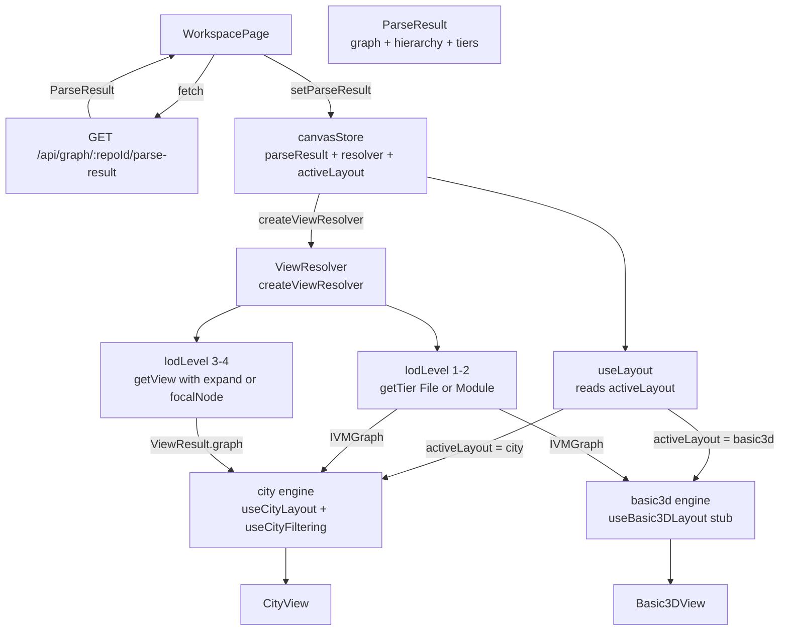
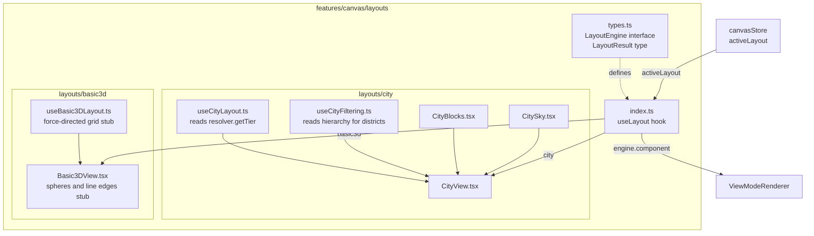
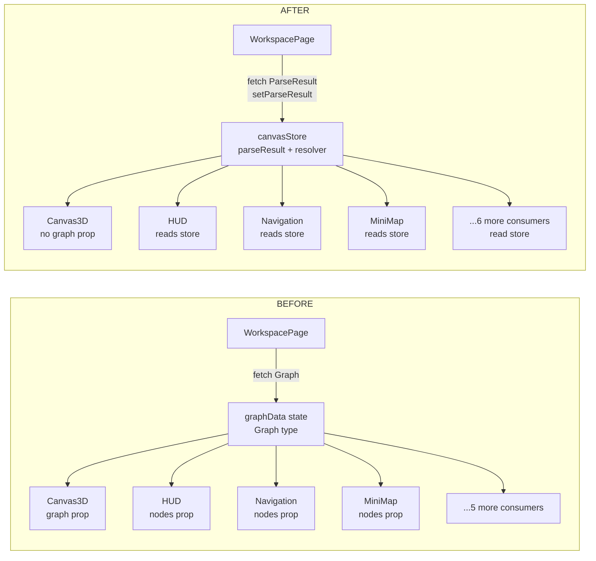

# Phase 5 — UI Integration Design Spec

## Problem

The canvas currently receives a UI-specific `Graph` type from `/api/graph/:repoId` and manually reconstructs semantic groupings (districts from path strings, clustering from node counts, LOD filtering) inside `useCityFiltering`. This duplicates logic that now lives properly in the `ParseResult`/`ViewResolver` layer built in Phases 1–4. The UI's own `GraphNode` type diverges from `IVMNode`, creating a maintenance burden and preventing the canvas from consuming tier views directly. There is also no layout architecture — city-specific code is scattered across `features/canvas/`, making it impossible to add alternative layouts (garden, basic 3D) without a major restructure.

## Solution

Migrate the UI to consume `ParseResult` directly. Replace the hand-rolled `Graph`/`GraphNode` types with `IVMGraph`/`IVMNode` from `@diagram-builder/core`. Wire `useCityLayout` and `useCityFiltering` to use `ViewResolver` tier views instead of the raw graph. Reorganize city-specific layout code into a `layouts/city/` module with a `LayoutEngine` interface, creating the foundation for alternative themes. Stub a `layouts/basic3d/` as the first sibling.

## Architecture Overview

### Diagram 1 — End-to-End Data Flow



### Diagram 2 — Layout Architecture



### Diagram 3 — WorkspacePage Before and After



## API Layer

### New: `GET /api/graph/:repoId/parse-result`

Returns `ParseResult`:

```typescript
{
  graph: IVMGraph                          // full detail (tier 5)
  hierarchy: GroupHierarchy                // semantic grouping tree
  tiers: Record<SemanticTier, IVMGraph>    // pre-computed tier views 0–5
}
```

Server calls `buildParseResult(ivmGraph)` (already implemented in `packages/parser`) before serializing. No new parsing work required.

**Client-side function added to `endpoints.ts`:**

```typescript
export const graph = {
  // existing
  getFullGraph: (repoId: string) => apiClient.get<IVMGraph>(`/api/graph/${repoId}`),

  // new
  getParseResult: (repoId: string) =>
    apiClient.get<ParseResult>(`/api/graph/${repoId}/parse-result`),

  getTier: (repoId: string, tier: SemanticTier) =>
    apiClient.get<IVMGraph>(`/api/graph/${repoId}/tier/${tier}`),
}
```

`WorkspacePage` replaces `graph.getFullGraph(repoId)` with `graph.getParseResult(repoId)`.

### New: `GET /api/graph/:repoId/tier/:tier`

Returns a single `IVMGraph` for the requested tier (0–5). Calls `resolver.getTier(tier)` server-side. Useful for consumers (CLI, export pipeline) that need a single tier slice without the full `ParseResult` payload.

### Existing: `GET /api/graph/:repoId`

The return type is updated from the UI `Graph` shape to `IVMGraph`. The server-side `graph-service.ts` is updated to populate `IVMNode.metadata.properties` with visual-rendering fields during the IVM conversion step. These values are computed by the parser enrichment pass (already runs during import) and stored alongside the graph in Neo4j as node properties:

| Field | `IVMNode` location | Neo4j property | Computed by |
|---|---|---|---|
| `parentId` | **top-level** `IVMNode.parentId` | `parentId` | Already present |
| `lod` | **top-level** `IVMNode.lod` | `lod` | Already present |
| `isExternal` | `metadata.properties.isExternal` | `isExternal` | Dependency analysis pass |
| `depth` | `metadata.properties.depth` | `depth` | Entry-point BFS pass |
| `methodCount` | `metadata.properties.methodCount` | `methodCount` | Child-count aggregation |
| `isAbstract` | `metadata.properties.isAbstract` | `isAbstract` | Node modifier extraction |
| `hasNestedTypes` | `metadata.properties.hasNestedTypes` | `hasNestedTypes` | Child-type presence check |
| `visibility` | `metadata.properties.visibility` | `visibility` | Access modifier extraction |
| `isDeprecated` | `metadata.properties.isDeprecated` | `isDeprecated` | JSDoc/annotation analysis |
| `isExported` | `metadata.properties.isExported` | `isExported` | Export modifier extraction |

Fields marked "Already present" are already top-level on `IVMNode` and require no migration. The remaining fields are added to the Neo4j query in `graph-service.ts` and written into `metadata.properties` during the graph serialization step.

## IVMNode Migration

### Blast Radius

This is a wide migration. Over 50 UI files currently import `GraphNode`, `Graph`, or `GraphEdge` directly or read visual fields at the call site. The migration proceeds as a dedicated TypeScript compilation pass: delete `graph.ts`, fix all type errors, verify tests. No other changes are made in the same commit to keep the diff reviewable.

### Field Mapping

**Important:** `GraphNode.label` is a top-level field; `IVMNode` has no top-level `label` — it lives at `metadata.label`. This is a field relocation, not just a type substitution. `GraphNode.metadata` is `Record<string, unknown>` (untyped bag), so some files may already read visual fields via `node.metadata.someKey` rather than top-level. The migration pass must audit both patterns — top-level reads and `metadata`-bag reads — across all 50+ affected files.

| Former `GraphNode` field | Post-migration access on `IVMNode` | Notes |
|---|---|---|
| `node.id` | `node.id` | unchanged |
| `node.type` | `node.type` | unchanged, see `abstract_class` note |
| `node.label` | `node.metadata.label` | **relocated** — was top-level |
| `node.position` | `node.position` | unchanged, already top-level |
| `node.lod` | `node.lod` | unchanged, already top-level |
| `node.parentId` | `node.parentId` | unchanged, already top-level |
| `node.isExternal` | `node.metadata.properties?.isExternal` | moved to properties bag |
| `node.depth` | `node.metadata.properties?.depth` | moved to properties bag |
| `node.methodCount` | `node.metadata.properties?.methodCount` | moved to properties bag |
| `node.isAbstract` | `node.metadata.properties?.isAbstract` | moved to properties bag |
| `node.hasNestedTypes` | `node.metadata.properties?.hasNestedTypes` | moved to properties bag |
| `node.visibility` | `node.metadata.properties?.visibility` | moved to properties bag |
| `node.isDeprecated` | `node.metadata.properties?.isDeprecated` | moved to properties bag |
| `node.isExported` | `node.metadata.properties?.isExported` | moved to properties bag |

### `abstract_class` Gap

`GraphNode.type` includes `abstract_class`; `IVMNode.type` does not. Abstract classes are represented as `type: 'class'` with `metadata.properties.isAbstract: true`. Rendering components already branch on `isAbstract` for shape selection — behavior is unchanged. The Neo4j query and `graph-service.ts` must ensure `isAbstract: true` is set for all nodes that previously had `type: 'abstract_class'`.

### `GraphEdge` → `IVMEdge`

`GraphEdge` had a narrower edge type set (`contains | depends_on | calls | inherits | imports`). `IVMEdge` has a superset. The rendering filters in `useCityFiltering` already allowlist specific types, so extra edge types are silently ignored. No logic change required.

## WorkspacePage Migration

`WorkspacePage` currently passes `graphData` (the old `Graph`) to seven consumers. After migration, `graphData` state is removed and replaced with `parseResult` in the canvas store. Each consumer migrates as follows:

| Consumer | Current | Post-migration |
|---|---|---|
| `Canvas3D` | `graph={graphData}` prop | reads `parseResult` from store internally via `useLayout` |
| `HUD` | `nodes={graphData.nodes}` | reads `IVMNode[]` from `canvasStore.parseResult.graph.nodes` |
| `NodeDetails` | `nodes={graphData.nodes}` | reads `IVMNode[]` from `canvasStore.parseResult.graph.nodes` |
| `Navigation` | `nodes={graphData.nodes}` | reads `IVMNode[]` from `canvasStore.parseResult.graph.nodes` |
| `SearchBarModal` | `nodes={graphData.nodes}` | reads `IVMNode[]` from `canvasStore.parseResult.graph.nodes` |
| `MiniMap` | `nodes={graphData.nodes}` | reads `IVMNode[]` from `canvasStore.parseResult.graph.nodes` |
| Camera root-node finder | `graphData.nodes.find(...)` | same lookup on `canvasStore.parseResult.graph.nodes` |
| `useGlobalKeyboardShortcuts` | `nodes: graphData?.nodes \|\| []` | reads `IVMNode[]` from `canvasStore.parseResult?.graph.nodes ?? []` |
| `SuccessNotification` (inline) | `` `Graph loaded with ${graphData.nodes?.length \|\| 0} nodes` `` | `` `Graph loaded with ${parseResult?.graph.nodes.length ?? 0} nodes` `` |

The nine consumers above cover all `graphData` references in `WorkspacePage`. The prop signatures of `HUD`, `NodeDetails`, `Navigation`, `SearchBarModal`, `MiniMap`, and `useGlobalKeyboardShortcuts` change from `nodes: GraphNode[]` to `nodes: IVMNode[]`. Internal rendering logic in each component migrates field access per the mapping table above.

`Canvas3D` drops its `graph?: Graph` prop entirely — the graph is now read from the store.

`graphData` local state in `WorkspacePage` is deleted. `loadGraphData` is renamed `loadParseResult` and calls `graph.getParseResult(repoId)` → `canvasStore.setParseResult(result)`.

## Layout Architecture

### Directory Structure

```
features/canvas/layouts/
  types.ts              ← LayoutEngine interface + LayoutResult type
  index.ts              ← useLayout hook
  city/
    useCityLayout.ts    ← moved, consumes IVMGraph from resolver.getTier(File)
    useCityFiltering.ts ← moved, delegates district grouping to GroupHierarchy
    CityView.tsx        ← moved
    CityBlocks.tsx      ← moved
    CitySky.tsx         ← moved
    ... (all city-specific files)
  basic3d/
    useBasic3DLayout.ts ← stub: force-directed flat grid positions
    Basic3DView.tsx     ← stub: spheres + line edges, no clustering
```

### LayoutEngine Interface and useLayout Hook

```typescript
// layouts/types.ts
export interface LayoutEngine {
  id: 'city' | 'basic3d'
  label: string
  component: React.ComponentType  // the root view component for this layout
}

export interface LayoutResult {
  engine: LayoutEngine
  // component is accessed as engine.component — no redundant top-level field
}

// layouts/index.ts
export function useLayout(): LayoutResult {
  const activeLayout = useCanvasStore((s) => s.activeLayout)
  const engine = activeLayout === 'city' ? cityEngine : basic3dEngine
  return { engine }
}
```

Usage in `ViewModeRenderer` (or equivalent):

```typescript
const { engine } = useLayout()
const LayoutView = engine.component
return <LayoutView />
```

Each layout view reads `IVMGraph` from the canvas store resolver internally — no props required.

### Canvas Store Additions

```typescript
parseResult: ParseResult | null
resolver: ViewResolver | null
activeLayout: 'city' | 'basic3d'

setParseResult(result: ParseResult): void
// Implementation: sets parseResult, creates and caches ViewResolver
// { parseResult: result, resolver: createViewResolver(result) }

setActiveLayout(layout: 'city' | 'basic3d'): void
```

## ViewResolver Integration

### useCityLayout

Reads `resolver` from the canvas store. Calls `resolver.getTier(SemanticTier.File)` for the initial layout IVMGraph. The `RadialCityLayoutEngine` receives `IVMGraph` instead of the old `Graph` — field access updates per the mapping table.

### useCityFiltering

District grouping drops the manual path-splitting loop. Districts are sourced directly from `parseResult.hierarchy`. `GroupHierarchy` only exposes `root: GroupNode` — there is no `getGroupsAtTier()` method. The implementation must walk `hierarchy.root` depth-first and collect all `GroupNode` entries where `group.tier === SemanticTier.Module`:

```typescript
function getModuleGroups(root: GroupNode): GroupNode[] {
  if (root.tier === SemanticTier.Module) return [root]
  return root.children.flatMap(getModuleGroups)
}
```

Derived structures:

- `districtGroups` (all-node grouping) — `Map<string, string[]>` keyed by `group.id`, values are `group.nodeIds`
- `fileDistrictGroups` (file-only, for cluster counts) — same, but `group.nodeIds` filtered to nodes with `type === 'file'`
- `clusteredNodeIds` — same two-pass child expansion as today, using `IVMNode.parentId`
- `nodeDistrict` reverse map — built from `group.nodeIds` as before

The edge-type allowlist in `visibleEdges` is updated: `'inherits'` (old `GraphEdge` type) becomes `'extends'` (IVMEdge type).

### Camera LOD → ViewResolver Mapping

The canvas store's existing `lodLevel` field (a 1-based integer 1–4 driven by camera distance) is **preserved unchanged** — it continues to control visual rendering fidelity (building detail, clustering). It is not replaced by SemanticTier values. Instead, a new translation layer maps the current `lodLevel` value to the appropriate ViewResolver call. The Camera LOD integers below are `canvasStore.lodLevel` values, not SemanticTier enum values.

`getView()` returns `ViewResult = { graph: IVMGraph, pruningReport?: PruningReport }`. All call sites extract `viewResult.graph` for rendering.

| `lodLevel` (camera) | Distance | ViewResolver call | Graph source |
|---|---|---|---|
| 1 (far) | > 120 | `resolver.getTier(SemanticTier.Module)` | `IVMGraph` directly |
| 2 (district) | 60–120 | `resolver.getTier(SemanticTier.File)` | `IVMGraph` directly |
| 3 (neighborhood) | 25–60 | `resolver.getView({ baseTier: SemanticTier.File, expand: [focusedGroupId] })` | `ViewResult.graph` |
| 4 (street) | < 25 | `resolver.getView({ baseTier: SemanticTier.Symbol, focalNodeId: selectedNodeId })` | `ViewResult.graph` |

`focusedGroupId` — the `GroupNode.id` of the district the camera is currently closest to. Stored as `canvasStore.focusedGroupId: string | null`. The centroid computation (camera position vs. mean of a group's node positions) is an implementation detail left to the agent; it should update when camera position settles (debounced), not every frame. `selectedNodeId` maps to existing `canvasStore.selectedNodeId`.

**Null guards:**

- **`focusedGroupId` is `null`** (initial state or camera not near any group) — LOD 3 falls back to the LOD 2 call: `resolver.getTier(SemanticTier.File)`. Do not pass `[null]` to `expand`.
- **`resolver` is `null`** (before `setParseResult` completes) — all hooks that read from `canvasStore.resolver` must guard with an early return and render nothing (empty graph `{ nodes: [], edges: [], metadata: ..., bounds: ... }`). This pattern must be applied consistently at all 50+ migration sites.

## Testing Strategy

### Unit Tests

- Field mapping — confirms all former `GraphNode` visual fields are accessible at their new `IVMNode` paths using a fixture node
- `useLayout` — correct `component` returned for each `activeLayout` value
- `useCityFiltering` — district groups sourced from `hierarchy.root.children` at Module tier, not path-string reconstruction; edge-type allowlist uses `'extends'` not `'inherits'`
- LOD→ViewResolver mapping — pure function tests confirming correct call args per camera distance; confirms `ViewResult.graph` is extracted (not `ViewResult` directly)

### Integration Tests

- `WorkspacePage` — mocks `/api/graph/:repoId/parse-result`, confirms `ParseResult` reaches store and `resolver` is initialized; confirms all nine former `graphData` consumers receive `IVMNode[]` from store (including `useGlobalKeyboardShortcuts` and the `SuccessNotification` node count)
- `useCityLayout` — fixture `ParseResult` → `resolver.getTier(File)` IVMGraph used for layout, not `parseResult.graph`
- Layout switcher — `city` ↔ `basic3d` swap renders the correct view component

### Regression Tests

The `GraphNode` deletion will produce TypeScript compilation errors across 50+ UI files. The migration commit is a dedicated type-fix pass — all errors must be resolved before the commit is made. Existing test suites must pass after the fix pass:
- All existing `useCityFiltering` tests
- All existing `useCityLayout` tests
- All existing component rendering tests (FileBlock, ClassBuilding, NodeRenderer, etc.)
- Phase 4 exporter tests (untouched by this phase)

### Out of Scope for Phase 5

- Rendering bug fixes
- Garden layout
- Multi-repo `ParseResult`
- Full basic3D implementation (stub only)

## Design Decisions

| Decision | Reasoning |
|---|---|
| Delete `Graph`/`GraphNode` types entirely | Two parallel graph types create divergence risk; IVMNode is the source of truth |
| Visual fields in `metadata.properties` | IVMNode's properties bag is the right extension point; avoids changing the IVMNode interface |
| `parentId` and `lod` stay top-level | Already exist on `IVMNode` interface; no migration needed |
| `abstract_class` → `class` + `isAbstract` | IVMNode has no `abstract_class` type; rendering already branches on `isAbstract` |
| `layouts/` directory | Isolates layout-specific code; adding a new theme is additive, not surgical |
| ViewResolver in canvas store | Avoids prop-drilling; any hook in the tree can access tier views |
| `Canvas3D` drops `graph` prop | Graph is now store-owned; prop was redundant and created two sources of truth |
| `focusedGroupId` in store | Camera-nearest district needed for LOD 3 expand; natural store addition alongside `selectedNodeId` |
| Basic3D stub in Phase 5 | Layout switching infrastructure lands now; full implementation is Phase 6 |
| Granular `/tier/:tier` endpoint | Supports future CLI/export consumers that need a single tier without full ParseResult payload |
