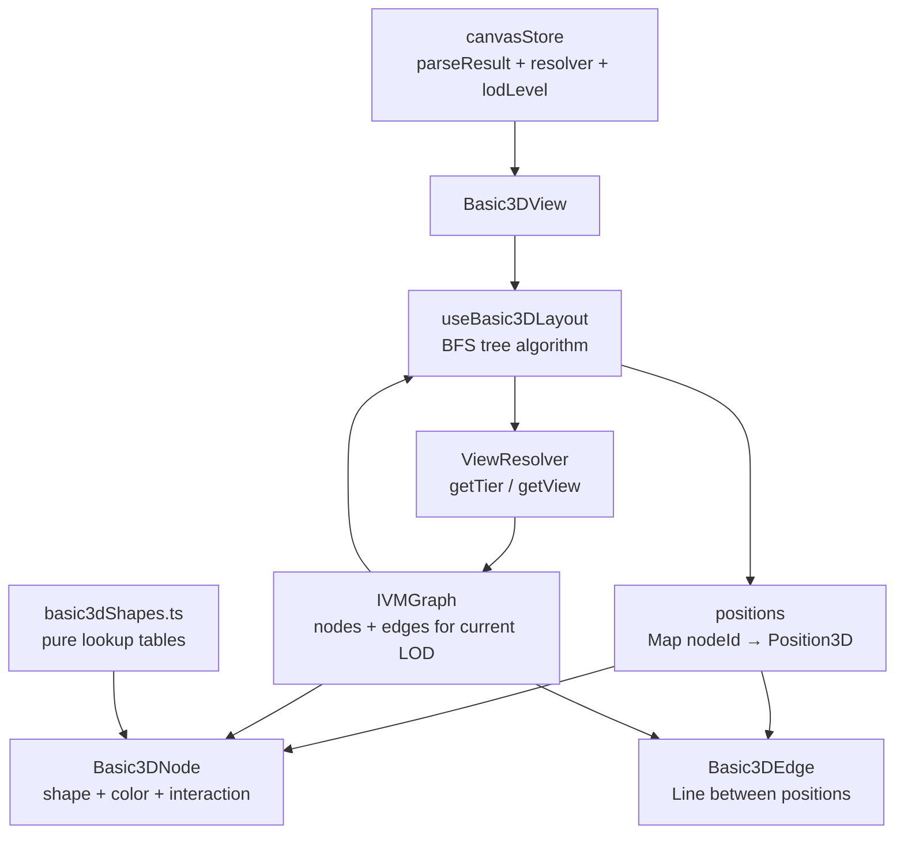

# Phase 6 — Basic3D Layout Design Spec

## Problem

The `basic3d` layout was stubbed in Phase 5 as two empty files (`useBasic3DLayout.ts`, `Basic3DView.tsx`). The layout switcher infrastructure is wired up — selecting `basic3d` renders `Basic3DView`, but the view is an empty group. Phase 6 implements the full Basic3D layout: a true 3D radial tree growing from entry points, with shape- and color-encoded nodes floating in space connected by branch edges.

## Solution

Implement `useBasic3DLayout` using a radial BFS tree algorithm seeded from each repo entry point. Nodes float in 3D space (no gravity), arranged on sphere shells at increasing depth from the roots. Replace `Basic3DView` with a full component tree that renders nodes as typed shapes and edges as lines. Wire the same 4-level LOD → ViewResolver mapping used by the city layout.

## Architecture Overview

### Diagram 1 — Data Flow



### Diagram 2 — File Structure

```
layouts/basic3d/
  useBasic3DLayout.ts     ← BFS tree algorithm + LOD wiring
  Basic3DView.tsx         ← root component, reads store, orchestrates
  Basic3DNode.tsx         ← single node: shape + color, hover/select
  Basic3DEdge.tsx         ← single edge: Line between two positions
  basic3dShapes.ts        ← shape/color lookup tables (pure data, no JSX)
```

## Layout Algorithm

### Radial BFS Tree

The BFS tree layout is extracted as a pure function for testability:

```typescript
export function buildRadialTree(
  graph: IVMGraph,
  options: { depthSpacing: number; rootRadius: number }
): Map<string, Position3D>
```

**Steps:**

1. **Identify entry points** — nodes where `metadata.properties.depth === 0`, or nodes with no incoming edges if `depth` is unavailable
2. **Place roots** — distribute entry-point nodes evenly on a small sphere shell at radius `rootRadius` around the origin (using Fibonacci sphere sampling for even distribution)
3. **BFS outward** — for each depth level, children are placed on a sphere shell at `rootRadius + (depth × depthSpacing)`, distributed evenly within the angular sector owned by their parent branch
4. **Shared dependencies** — nodes with multiple parents are placed at the centroid of their parent positions; edges are drawn to all parents
5. **Return** `Map<string, Position3D>` keyed by node ID

Layout is memoized on `[graph]`. Positions are published to the canvas store after computation so camera flight can target them.

### Return Type

```typescript
export interface Basic3DLayoutResult {
  positions: Map<string, Position3D>
  bounds: BoundingBox
  maxDepth: number  // deepest branch — drives initial camera distance
}
```

## LOD / ViewResolver Integration

Basic3D uses the same 4-level camera distance system as the city layout. The `lodLevel` → ViewResolver mapping is identical — `useBasic3DLayout` reads `resolver` and `lodLevel` from the canvas store and calls the appropriate ViewResolver method.

| `lodLevel` | Camera Distance | ViewResolver Call | What Renders |
|---|---|---|---|
| 1 (far) | > 120 | `resolver.getTier(SemanticTier.Module)` | Module discs only, sparse tree |
| 2 (mid) | 60–120 | `resolver.getTier(SemanticTier.File)` | File hubs + module discs |
| 3 (near) | 25–60 | `resolver.getView({ baseTier: SemanticTier.File, expand: [focusedNodeId] })` | Expanded branch — symbols visible inside focused file |
| 4 (close) | < 25 | `resolver.getView({ baseTier: SemanticTier.Symbol, focalNodeId: selectedNodeId })` | Full symbol detail — methods, types, constants |

`focusedNodeId` is the nearest node to the camera. Updated via debounced camera position check — same pattern as `focusedGroupId` in city. Falls back to LOD 2 call when null.

**Null guards:** If `resolver` is null (before `setParseResult` completes), return empty graph `{ nodes: [], edges: [] }`. Applied consistently at all call sites.

## Node Visual Encoding

### Shape Mapping

| `IVMNode.type` | Shape | Rationale |
|---|---|---|
| `file` / `module` | Disc (flat cylinder) | Hub node, branching point |
| `class` | Box / cube | Structured, architectural |
| `class` + `isAbstract: true` | Wireframe box | Structural but open |
| `interface` / `type` | Icosahedron (wireframe) | Geometric, structural, transparent |
| `function` / `method` | Sphere | Self-contained, rounded |
| `variable` / `constant` | Octahedron (gem) | Solid, faceted |
| `enum` | Cylinder | Ordered, list-like |

### Color Mapping

| Category | Color | Hex |
|---|---|---|
| Functions / methods | Blue | `#4A90D9` |
| Classes | Orange | `#E67E22` |
| Interfaces / types | Gray | `#95A5A6` |
| Files / modules | Green | `#27AE60` |
| Variables / constants | Purple | `#9B59B6` |
| Enums | Amber | `#F39C12` |

Both mappings are exported from `basic3dShapes.ts` as pure lookup functions with no JSX:

```typescript
export function getShapeForType(type: NodeType): Basic3DShape
export function getColorForType(type: NodeType): string
```

**Size:** Uniform base size per shape type. No metric encoding in Phase 6.

**Edges:** Thin lines via `<Line>` from `@react-three/drei`, opacity `0.4` to reduce visual noise when many edges intersect.

## Component Design

### `Basic3DView`

Root component. Reads `parseResult`, `resolver`, `lodLevel`, `selectedNodeId`, `focusedNodeId` from canvas store. Calls `useBasic3DLayout()` to get positions. Renders one `<Basic3DNode>` per node and one `<Basic3DEdge>` per edge in the current LOD graph.

### `Basic3DNode`

Props: `node: IVMNode`, `position: Position3D`, `isSelected: boolean`

- Looks up shape geometry and color from `basic3dShapes.ts`
- On hover: shows tooltip via existing HUD tooltip system
- On click: calls `canvasStore.setSelectedNodeId(node.id)`
- Selected state: slight emissive highlight on material

### `Basic3DEdge`

Props: `from: Position3D`, `to: Position3D`

Renders a `<Line>` between the two positions. Fixed opacity, no interaction.

### `basic3dShapes.ts`

Pure data module. Exports `getShapeForType` and `getColorForType`. No React imports. Independently unit-testable.

## Multi-Root Handling

Repos with multiple entry points (`depth === 0`) each become their own root node, placed around the center using Fibonacci sphere sampling at `rootRadius`. Branches from different roots can and will interweave — shared dependencies will have edges to nodes in multiple subtrees. This is intentional and accurately reflects the real dependency graph structure.

## Testing Strategy

### Unit Tests

- **`basic3dShapes.ts`** — every `NodeType` value returns a defined shape and color (no fallthrough to undefined)
- **`buildRadialTree`** — correct depth assignment; entry nodes at depth 0; shared deps positioned at centroid of parents; output is deterministic given same input; multiple entry points placed around center
- **LOD → ViewResolver mapping** — correct ViewResolver call args for each `lodLevel` value; null `resolver` returns empty graph; null `focusedNodeId` at LOD 3 falls back to LOD 2 call

### Component Tests

- **`Basic3DNode`** — renders correct shape mesh for each `NodeType`; applies selected highlight when `isSelected: true`; fires `setSelectedNodeId` on click; tooltip appears on hover
- **`Basic3DEdge`** — renders a `<Line>` between the two provided positions
- **`Basic3DView`** — given a fixture `ParseResult`, positions are computed and nodes/edges rendered; changing `lodLevel` in store changes the graph passed to layout

### Integration Tests

- **Layout switcher** — `canvasStore.setActiveLayout('basic3d')` causes `useLayout` to return `Basic3DView` as the active component; switching back to `'city'` restores `CityView`

### E2E Tests (Playwright)

- **Layout switch** — load a repo on the canvas, toggle from city to basic3d via the layout switcher UI, confirm `basic3d-view` group is present in the scene and `city-view` group is absent
- **Node interaction** — in basic3d mode, click a visible node, confirm the node details panel opens with the correct node name and type
- **LOD transition** — zoom camera from far (LOD 1) to close (LOD 4), confirm node count in the scene increases at each threshold
- **Hover tooltip** — hover over a node, confirm tooltip appears with node name
- **Multi-root render** — load a repo with multiple entry points, confirm multiple root nodes are visible near the center of the scene at LOD 1

## Design Decisions

| Decision | Reasoning |
|---|---|
| Radial BFS tree over force-directed | Deterministic, fast, preserves "growing from roots" metaphor; force relaxation can be added later if crowding is an issue |
| Multiple root nodes (no synthetic root) | Accurately represents repos with multiple entry points; interweaving branches reflect real dependency graph |
| Fibonacci sphere sampling for root/child placement | Evenly distributes nodes on sphere shells without clustering at poles |
| Same LOD → ViewResolver mapping as city | Reuses existing infrastructure; consistent zoom behavior across layouts |
| `focusedNodeId` replaces `focusedGroupId` | Tree has no district concept — nearest node to camera is the natural equivalent |
| `basic3dShapes.ts` as pure data module | Lookup tables have no reason to be components; pure functions are trivially testable |
| Uniform node size in Phase 6 | Metric encoding adds complexity; establish the spatial metaphor first, encode metrics later |
| Edge opacity 0.4 | Dense graphs produce many crossing edges; low opacity keeps branches readable without hiding connections |

## Out of Scope for Phase 6

- Animation / node transition effects
- Re-root interaction (user-selectable root node)
- Metric-based node size encoding
- Performance optimization for very large graphs (> 5000 nodes)
- Garden layout
