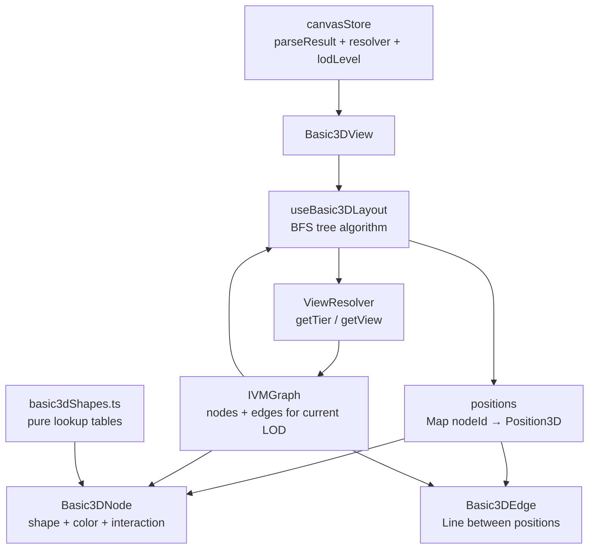

# Phase 6 — Basic3D Layout Design Spec

## Problem

The `basic3d` layout was stubbed in Phase 5 as two empty files (`useBasic3DLayout.ts`, `Basic3DView.tsx`). The layout switcher infrastructure is wired up — selecting `basic3d` renders `Basic3DView`, but the view is an empty group. Phase 6 implements the full Basic3D layout: a true 3D radial tree growing from entry points, with shape- and color-encoded nodes floating in space connected by branch edges.

## Solution

Implement `useBasic3DLayout` using a radial BFS tree algorithm seeded from each repo entry point. Nodes float in 3D space (no gravity), arranged on sphere shells at increasing depth from the roots. Replace `Basic3DView` with a full component tree that renders nodes as typed shapes and edges as lines. Wire the same LOD → ViewResolver behavior used by the city layout: all LOD levels use `SemanticTier.Symbol` as the base tier; visual fidelity differentiates by LOD, not by tier switching.

## Architecture Overview

### Diagram 1 — Data Flow



### Diagram 2 — File Structure

```
layouts/basic3d/
  useBasic3DLayout.ts     ← BFS tree algorithm + LOD wiring
  Basic3DView.tsx         ← root component, reads store, orchestrates
  Basic3DNode.tsx         ← single node: shape + color, hover/select
  Basic3DEdge.tsx         ← single edge: Line between two positions
  basic3dShapes.ts        ← shape/color lookup tables (pure data, no JSX)
```

## Layout Algorithm

### Radial BFS Tree

The BFS tree layout is extracted as a pure function for testability:

```typescript
export function buildRadialTree(
  graph: IVMGraph,
  options: { depthSpacing: number; rootRadius: number }
): Map<string, Position3D>
```

**Steps:**

1. **Identify entry points** — nodes where `metadata.properties.depth === 0`, or nodes with no incoming edges if `depth` is unavailable
2. **Place roots** — distribute entry-point nodes evenly on a small sphere shell at radius `rootRadius` around the origin using Fibonacci sphere sampling for even distribution across the surface
3. **BFS outward** — for each depth level, a parent node owns a solid angle sector of the sphere. Its children are distributed evenly within that sector at `rootRadius + (depth × depthSpacing)`. The solid angle of each parent's sector is proportional to the fraction of total child nodes it is responsible for. The exact subdivision within the sector is left to the implementer's discretion (e.g., recursive spherical coordinate subdivision).
4. **Shared dependencies** — nodes with multiple parents are placed at the centroid of their parent positions. If the centroid coincides with an existing node's position, apply a small random jitter offset (magnitude ≤ `depthSpacing * 0.1`) to prevent overlap. Edges are drawn from the shared node to all parents.
5. **Return** `Map<string, Position3D>` keyed by node ID

Layout is memoized on `[graph]`. Positions are published to the canvas store via `setLayoutPositions` after computation so camera flight can target them (same `useEffect` pattern as `useCityLayout`).

### Return Type

```typescript
export interface Basic3DLayoutResult {
  positions: Map<string, Position3D>
  bounds: BoundingBox
  maxDepth: number  // deepest branch — drives initial camera distance
}
```

## LOD / ViewResolver Integration

Basic3D uses the same LOD → ViewResolver behavior as the city layout. All four LOD levels use `SemanticTier.Symbol` as the base tier — visual differentiation comes from rendering detail (edge visibility, label visibility, shape size), not from tier switching. This matches the as-shipped city behavior where tier switching at LOD 1/2 produced empty graphs in V2 mode.

| `lodLevel` | Camera Distance | ViewResolver Call | Visual Detail |
|---|---|---|---|
| 1 (far) | > 120 | `resolver.getTier(SemanticTier.Symbol)` | Nodes only, no edge labels, minimal detail |
| 2 (mid) | 60–120 | `resolver.getTier(SemanticTier.Symbol)` | Nodes + edges, no labels |
| 3 (near) | 25–60 | `resolver.getTier(SemanticTier.Symbol)` | Nodes + edges + node labels |
| 4 (close) | < 25 | `resolver.getView({ baseTier: SemanticTier.Symbol, focalNodeId: selectedNodeId }).graph` | Focal subgraph — full detail around selected node |

**LOD 4 null guard:** If `selectedNodeId` is null, fall back to `resolver.getTier(SemanticTier.Symbol)`.

**No `expand` call at LOD 3:** Basic3D has no group/district concept, so there is no `GroupNode.id` to pass to `expand`. LOD 3 uses the same full Symbol graph as LOD 1–2, with visual detail as the differentiator.

**`nearestNodeId`:** For future extensibility, `useBasic3DLayout` computes the node nearest to the camera position (debounced, same pattern as `focusedGroupId` in city) and writes it to `canvasStore.nearestNodeId` via `setNearestNodeId`. This is a new store field — distinct from `focusedNodeId`, which is used by the city-to-cell navigation system (`enterNode`/`exitToParent`). Phase 6 does not use `nearestNodeId` for ViewResolver calls, but it is available for future LOD 3 expand behavior if a grouping concept is added later.

**General null guard:** If `resolver` is null (before `setParseResult` completes), return empty graph. Applied at all call sites.

## Node Visual Encoding

### Shape Mapping

All 13 valid `NodeType` values are covered. `constant` is not a valid `NodeType` and does not appear here.

| `IVMNode.type` | Shape | Rationale |
|---|---|---|
| `file` | Disc (flat cylinder) | Hub node, branching point |
| `directory` | Large disc (flat cylinder, larger radius) | Container for files |
| `module` | Disc (flat cylinder) | Hub node at module level |
| `class` | Box / cube | Structured, architectural |
| `class` + `isAbstract: true` | Wireframe box | Structural but open |
| `interface` | Icosahedron (wireframe) | Geometric, structural, transparent |
| `type` | Icosahedron (wireframe) | Same as interface — structural |
| `function` | Sphere | Self-contained, rounded |
| `method` | Sphere (smaller) | Self-contained, method-scoped |
| `variable` | Octahedron (gem) | Solid, faceted |
| `enum` | Cylinder | Ordered, list-like |
| `namespace` | Ring / torus | Structural container, no implementation |
| `package` | Large box (outline) | Top-level structural container |
| `repository` | Very large box (outline) | Root container |

### Color Mapping

| `IVMNode.type` | Color | Hex |
|---|---|---|
| `function` / `method` | Blue | `#4A90D9` |
| `class` | Orange | `#E67E22` |
| `interface` / `type` | Gray | `#95A5A6` |
| `file` / `directory` / `module` | Green | `#27AE60` |
| `variable` | Purple | `#9B59B6` |
| `enum` | Amber | `#F39C12` |
| `namespace` / `package` / `repository` | White | `#ECEFF1` |

These are exported from `basic3dShapes.ts` as pure lookup functions with no JSX:

```typescript
export function getShapeForType(type: NodeType): Basic3DShape
export function getColorForType(type: NodeType): string
export function isAbstractNode(node: IVMNode): boolean
```

`getShapeForType` returns the base shape for a type (e.g., `box` for `class`). Abstract classes share `type: 'class'` in `IVMNode` — the wireframe variant is applied by `Basic3DNode` via a separate `isAbstractNode` check on `node.metadata.properties?.isAbstract`. `Basic3DNode` handles the abstract modifier independently:

```typescript
const baseShape = getShapeForType(node.type)
const wireframe = isAbstractNode(node)  // true → render as wireframe mesh
```

**Size:** Uniform base size per shape type. No metric encoding in Phase 6.

**Edges:** Thin lines via `<Line>` from `@react-three/drei`, opacity `0.4` to reduce visual noise when many edges intersect.

## Component Design

### `Basic3DView`

Root component. Reads `parseResult`, `resolver`, `lodLevel`, `selectedNodeId` from canvas store. Calls `useBasic3DLayout()` to get positions. Renders one `<Basic3DNode>` per node and one `<Basic3DEdge>` per edge in the current LOD graph.

### `Basic3DNode`

Props: `node: IVMNode`, `position: Position3D`, `isSelected: boolean`

- Looks up shape geometry and color from `basic3dShapes.ts`
- On hover: shows tooltip via existing HUD tooltip system
- On click: calls `canvasStore.selectNode(node.id)`
- Selected state: slight emissive highlight on material

### `Basic3DEdge`

Props: `from: Position3D`, `to: Position3D`

Renders a `<Line>` between the two positions. Fixed opacity `0.4`, no interaction.

### `basic3dShapes.ts`

Pure data module. Exports `getShapeForType` and `getColorForType`. No React imports. Independently unit-testable.

## Canvas Store Additions

Phase 6 adds one new field to the canvas store:

```typescript
nearestNodeId: string | null          // node nearest to camera in basic3d mode
setNearestNodeId(id: string | null): void
```

`nearestNodeId` is distinct from `focusedNodeId` (used by city-to-cell navigation). It is computed by `useBasic3DLayout` via a debounced camera position check (same pattern as `focusedGroupId` in city). Reset to `null` when switching away from the basic3d layout.

## `UILayoutEngine` Interface

The existing interface in `layouts/types.ts` is named `UILayoutEngine` (not `LayoutEngine`). The basic3d engine satisfies this interface:

```typescript
const basic3dEngine: UILayoutEngine = {
  id: 'basic3d',
  label: 'Basic 3D',
  component: Basic3DView,
}
```

No changes to `layouts/types.ts` or `layouts/index.ts` are required beyond registering `basic3dEngine`.

## Multi-Root Handling

Repos with multiple entry points (`depth === 0`) each become their own root node, placed around the center using Fibonacci sphere sampling at `rootRadius`. Branches from different roots can and will interweave — shared dependencies will have edges to nodes in multiple subtrees. This is intentional and accurately reflects the real dependency graph structure.

## Testing Strategy

### Unit Tests

- **`basic3dShapes.ts`** — every valid `NodeType` value (all 13) returns a defined shape and a defined color; no fallthrough to undefined
- **`buildRadialTree`** — correct depth assignment; entry nodes at depth 0; shared deps positioned at centroid of parents (with jitter when centroid collides); output is deterministic given same input; multiple entry points placed around center via Fibonacci sampling
- **LOD → ViewResolver mapping** — LOD 1–3 all call `resolver.getTier(SemanticTier.Symbol)`; LOD 4 calls `getView` with `focalNodeId`; null `resolver` returns empty graph; null `selectedNodeId` at LOD 4 falls back to `getTier(Symbol)`
- **`setLayoutPositions`** — positions published to store after layout computation

### Component Tests

- **`Basic3DNode`** — renders correct shape mesh for each `NodeType`; applies selected highlight when `isSelected: true`; fires `selectNode` on click; tooltip appears on hover
- **`Basic3DEdge`** — renders a `<Line>` between the two provided positions with opacity `0.4`
- **`Basic3DView`** — given a fixture `ParseResult`, positions are computed and nodes/edges rendered; changing `lodLevel` in store from 1–3 does not change the graph (same Symbol tier call); LOD 4 with a selected node produces a focal subgraph

### Integration Tests

- **Layout switcher** — `canvasStore.setActiveLayout('basic3d')` causes `useLayout` to return `Basic3DView` as the active component (satisfying `UILayoutEngine`); switching back to `'city'` restores `CityView`

### E2E Tests (Playwright)

- **Layout switch** — load a repo on the canvas, toggle from city to basic3d via the layout switcher UI, confirm `basic3d-view` group is present in the scene and `city-view` group is absent
- **Node interaction** — in basic3d mode, click a visible node, confirm the node details panel opens with the correct node name and type
- **LOD transition** — zoom camera from far (LOD 1) to close (LOD 4); the fixture must have `selectedNodeId` set to a node with at least one neighbor in the Symbol graph before the zoom, so the `getView` focal subgraph at LOD 4 is meaningfully larger than the full Symbol graph fallback; confirm node count at LOD 4 is greater than LOD 1
- **Hover tooltip** — hover over a node, confirm tooltip appears with node name
- **Multi-root render** — load a repo with multiple entry points, confirm multiple root nodes are visible near the center of the scene at LOD 1

## Design Decisions

| Decision | Reasoning |
|---|---|
| Radial BFS tree over force-directed | Deterministic, fast, preserves "growing from roots" metaphor; force relaxation can be added later if crowding is an issue |
| Multiple root nodes (no synthetic root) | Accurately represents repos with multiple entry points; interweaving branches reflect real dependency graph |
| Fibonacci sphere sampling for root/child placement | Evenly distributes nodes on sphere shells without clustering at poles |
| All LOD levels use `SemanticTier.Symbol` | Matches as-shipped city behavior; tier switching at LOD 1/2 produced empty graphs in V2 mode; visual fidelity differentiates by LOD, not tier |
| No `expand` call at LOD 3 | Basic3D has no group/district concept; `expand` expects `GroupNode.id` values which don't exist in the tree context |
| `nearestNodeId` as new store field (not `focusedNodeId`) | `focusedNodeId` is already used by city-to-cell navigation (`enterNode`/`exitToParent`); reusing it would break city behavior |
| `basic3dShapes.ts` as pure data module | Lookup tables have no reason to be components; pure functions are trivially testable and have zero React coupling risk |
| Uniform node size in Phase 6 | Metric encoding adds complexity; establish the spatial metaphor first, encode metrics later |
| Edge opacity `0.4` | Dense graphs produce many crossing edges; low opacity keeps branches readable without hiding connections |
| `setLayoutPositions` call in `useBasic3DLayout` | Same pattern as city layout; required for camera flight (`requestFlyToNode`) to work in basic3d mode |

## Out of Scope for Phase 6

- Animation / node transition effects
- Re-root interaction (user-selectable root node)
- Metric-based node size encoding
- LOD 3 expand behavior (requires grouping concept to be defined for tree layout)
- Performance optimization for very large graphs (> 5000 nodes)
- Garden layout
