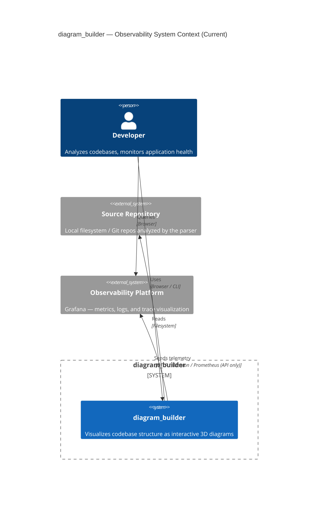
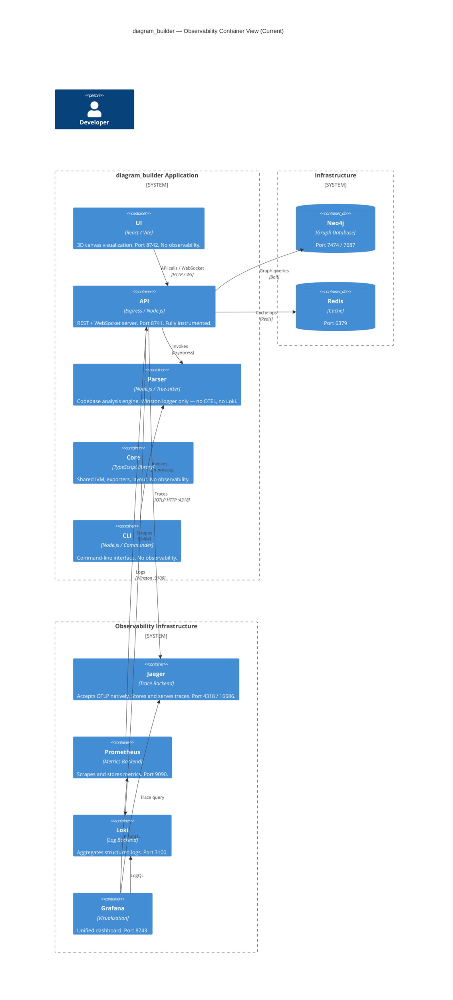
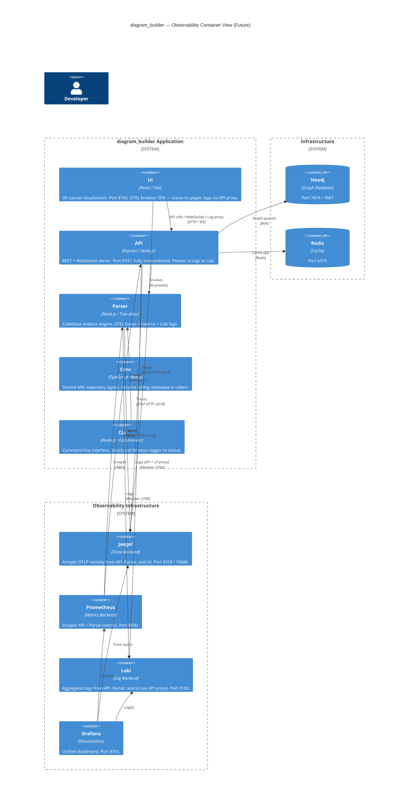

# Observability Architecture

_Last updated: 2026-04-04_

## Overview

This document describes the observability architecture for the diagram_builder application. It captures the current state of instrumentation, identifies gaps, and defines a single target future state where all packages emit consistent telemetry.

### Signal Types

| Signal | Purpose | Backend |
|---|---|---|
| **Traces** | Distributed request flow, latency attribution | Jaeger |
| **Metrics** | Counters, gauges, histograms for SLIs/SLOs | Prometheus |
| **Logs** | Structured event records with context | Loki |

### Stack Summary

| Component | Role | Version |
|---|---|---|
| OpenTelemetry SDK | Instrumentation layer (API + future packages) | `^1.9.0` |
| Jaeger | Trace storage and UI — accepts OTLP natively on :4318 | `2.1.0` |
| Prometheus | Metrics storage and query | `v3.1.0` |
| Loki | Log aggregation | `3.3.2` |
| Grafana | Unified visualization | `11.4.0` |
| Winston | Structured logger (Node packages) | `^3.x` |

> **Note:** An OTEL Collector config exists at `config/otel-collector/config.yaml` but is not wired into `docker-compose.yml` and is not running. Jaeger 2.x's native OTLP support makes a collector optional for the current scope. Adding a collector is a future architecture evaluation item.

### Promotion Process

Diagrams exist in two states: **Current** and **Future**. When a future state feature is fully implemented and merged to main, the future state diagram replaces the current state diagram and the future state section is updated to reflect the next target. Each promotion should be accompanied by a dated note in this document.

---

## Current State

_As of 2026-04-04. Only the `api` package is instrumented._

### C4 Level 1 — System Context

> **Note:** At this level the system appears fully instrumented. The gap is only visible in the Container diagram where it becomes clear only the `api` package emits telemetry.

---

### C4 Level 2 — Container

---

### Signal Inventory (Current)

| Package | Traces | Metrics | Logs | Notes |
|---|---|---|---|---|
| `api` | OTEL auto + manual `neo4j.query` span | 6 Prometheus metrics via `PrometheusExporter` | Winston → Loki (when `LOKI_ENABLED=true`) | Requires `OTEL_ENABLED=true` to activate |
| `parser` | None | None | Winston → console / file only | Logger exists but no Loki transport |
| `ui` | None | None | `console.log` only | No structured logger |
| `core` | None | None | None | Pure library |
| `cli` | None | None | None | No logger |

#### API Metrics Detail

| Metric | Type | Labels |
|---|---|---|
| `http_requests_total` | Counter | `method`, `route`, `status_code` |
| `http_request_duration_seconds` | Histogram | `method`, `route`, `status_code` |
| `ws_active_sessions` | UpDownCounter | `repository_id` |
| `db_query_duration_seconds` | Histogram | `operation` |
| `cache_operations_total` | Counter | `operation`, `result` |
| `parser_duration_seconds` | Histogram | `language` |

---

## Gap Analysis

| Package | Missing Signals | Root Cause |
|---|---|---|
| `parser` | Traces, Metrics, Loki log shipping | Winston logger exists but no OTEL SDK, no Loki transport |
| `ui` | Traces, Metrics, Logs | No instrumentation at all. Browser-to-backend telemetry path not established. |
| `core` | Traces, Metrics, Logs | Pure library — no runtime or I/O to instrument directly |
| `cli` | Logs | No logger of any kind |

### Key Observations

- **`parser`** is the highest-value gap. Parse runs are the most expensive operations in the system. Duration, file count, language, and error rate are all invisible today. The API currently records a `parser_duration_seconds` metric in `codebase-service.ts` as a proxy — in the future state this metric should move to the parser itself with finer-grained labels (`phase`, `language`). The API-side metric should be removed to avoid double-counting.
- **`ui`** is partially prepared. `docker-compose.yml` already sets `OTEL_ENABLED=true` and `OTEL_EXPORTER_OTLP_ENDPOINT=http://jaeger:4318` on the UI container, but the UI package has no OTEL SDK installed — the env vars are unused. There is also a malformed env var (`OTEL_EXPORTER_OTLP_ENDPOINT=http://localhost:4318=value`) that should be cleaned up.
- **`ui` observability** has no visibility into render performance, WebGL frame rates, layout computation time, user interactions, or client-side errors. The `ErrorBoundary` component exists but only logs to console.
- **`core`** is a pure library with no I/O — direct OTEL instrumentation is not appropriate. The right pattern is returning timing metadata from expensive operations (layout, export serialization) so callers can record it.
- **`cli`** is a one-shot process. Metrics and traces are not meaningful. Structured logging to stdout/stderr is the only gap.
- **OTEL Collector** config exists at `config/otel-collector/config.yaml` but is not deployed. Jaeger 2.x accepts OTLP directly on port 4318, making the collector optional for current scope.

---

## Future State

_Target: all packages emit appropriate telemetry using the existing stack._

### C4 Level 1 — System Context

---

### C4 Level 2 — Container

---

### Signal Inventory (Future)

| Package | Traces | Metrics | Logs | Notes |
|---|---|---|---|---|
| `api` | OTEL auto + manual `neo4j.query` span | 6 metrics via `PrometheusExporter` (port 9464) | Winston → Loki | No change from current |
| `parser` | OTEL spans: parse run, per-file, graph build | `parser_files_total`, `parser_run_duration_seconds`, `parser_errors_total` via `PrometheusExporter` (port 9465) | Winston + Loki transport, `{app="diagram-builder-parser"}` | Mirrors API pattern. API's `parser_duration_seconds` metric removed to avoid double-counting. |
| `ui` | OTEL browser SDK: page load, layout render, canvas paint | `ui_render_duration_ms`, `ui_errors_total` via OTLP → Collector | `POST /api/logs` → API → Loki, `{app="diagram-builder-ui"}` | Browser → API proxy avoids CORS to Loki |
| `core` | None (library) | None (library) | None (library) | Expensive ops return `{ result, durationMs }` for callers to record |
| `cli` | None | None | Winston → stdout (structured JSON, level via `--verbose`) | One-shot process — no persistent telemetry |

#### Parser Metrics Detail (Future)

| Metric | Type | Labels |
|---|---|---|
| `parser_files_total` | Counter | `language`, `status` (`parsed`, `skipped`, `error`) |
| `parser_run_duration_seconds` | Histogram | `language`, `phase` (`scan`, `parse`, `graph`) |
| `parser_errors_total` | Counter | `language`, `error_type` |

#### UI Metrics Detail (Future)

| Metric | Type | Labels |
|---|---|---|
| `ui_render_duration_ms` | Histogram | `view` (`city`, `basic3d`), `node_count_bucket` |
| `ui_errors_total` | Counter | `boundary` (`ErrorBoundary`), `error_type` |
