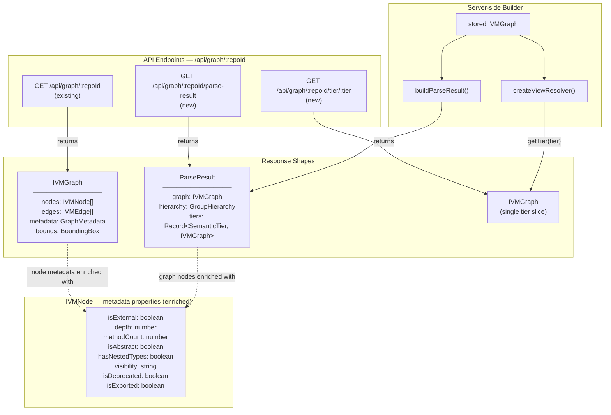

# Phase 5 — API Endpoint Shape

```mermaid
graph TB
    subgraph Endpoints["API Endpoints — /api/graph/:repoId"]
        A["GET /api/graph/:repoId\n(existing)"]
        B["GET /api/graph/:repoId/parse-result\n(new)"]
        C["GET /api/graph/:repoId/tier/:tier\n(new)"]
    end

    subgraph Responses["Response Shapes"]
        D["IVMGraph\n───────────────\nnodes: IVMNode[]\nedges: IVMEdge[]\nmetadata: GraphMetadata\nbounds: BoundingBox"]
        E["ParseResult\n───────────────\ngraph: IVMGraph\nhierarchy: GroupHierarchy\ntiers: Record&lt;SemanticTier, IVMGraph&gt;"]
        F["IVMGraph\n(single tier slice)"]
    end

    subgraph IVMNode["IVMNode — metadata.properties (enriched)"]
        G["isExternal: boolean\ndepth: number\nmethodCount: number\nisAbstract: boolean\nhasNestedTypes: boolean\nvisibility: string\nisDeprecated: boolean\nisExported: boolean"]
    end

    subgraph Builder["Server-side Builder"]
        H["stored IVMGraph"]
        I["buildParseResult()"]
        J["createViewResolver()"]
    end

    A -->|"returns"| D
    B -->|"returns"| E
    C -->|"returns"| F

    H --> I
    I --> E
    H --> J
    J -->|"getTier(tier)"| F

    D -.->|"node metadata enriched with"| G
    E -.->|"graph nodes enriched with"| G
```
